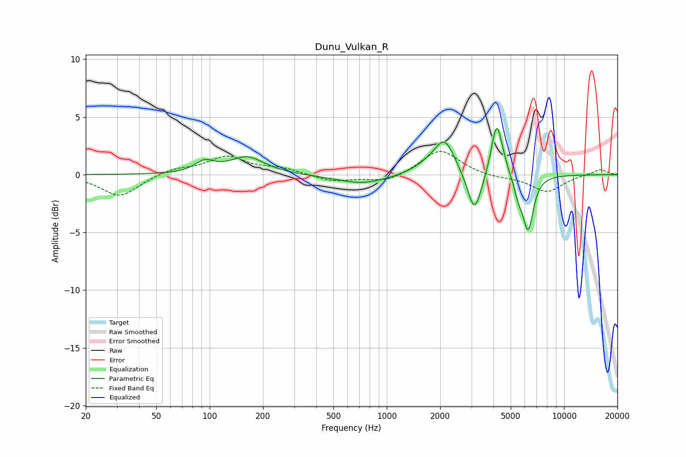

# Dunu_Vulkan_R
See [usage instructions](https://github.com/jaakkopasanen/AutoEq#usage) for more options and info.

### Parametric EQs
Apply preamp of -4.1 dB when using parametric equalizer.

|   # | Type    |   Fc (Hz) |    Q |   Gain (dB) |
|-----|---------|-----------|------|-------------|
|   1 | Peaking |        94 | 2.69 |         0.9 |
|   2 | Peaking |       162 | 1.45 |         1.5 |
|   3 | Peaking |       729 | 0.96 |        -0.8 |
|   4 | Peaking |      1722 | 1.65 |         0.7 |
|   5 | Peaking |      2122 | 2.48 |         2.8 |
|   6 | Peaking |      3124 | 3.6  |        -3.7 |
|   7 | Peaking |      4146 | 4.92 |         3.8 |
|   8 | Peaking |      4371 | 3.98 |         1.1 |
|   9 | Peaking |      5525 | 6    |        -1.3 |
|  10 | Peaking |      6269 | 4.58 |        -4.7 |

### Fixed Band EQs
When using fixed band (also called graphic) equalizer, apply preamp of **-2.1 dB** (if available) and set gains manually with these parameters.

|   # | Type    |   Fc (Hz) |    Q |   Gain (dB) |
|-----|---------|-----------|------|-------------|
|   1 | Peaking |        31 | 1.41 |        -1.9 |
|   2 | Peaking |        62 | 1.41 |         0.5 |
|   3 | Peaking |       125 | 1.41 |         1.5 |
|   4 | Peaking |       250 | 1.41 |         0.5 |
|   5 | Peaking |       500 | 1.41 |        -0.6 |
|   6 | Peaking |      1000 | 1.41 |        -0.7 |
|   7 | Peaking |      2000 | 1.41 |         2.2 |
|   8 | Peaking |      4000 | 1.41 |        -0.2 |
|   9 | Peaking |      8000 | 1.41 |        -1.5 |
|  10 | Peaking |     16000 | 1.41 |         0.5 |

### Graphs

