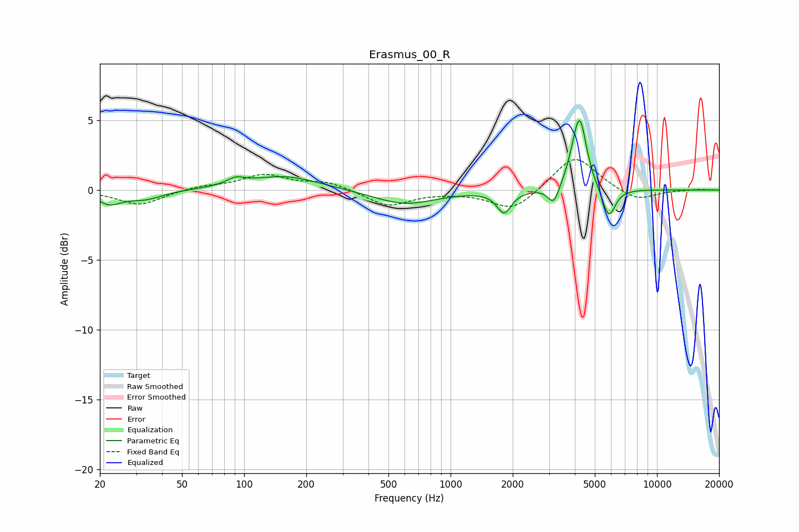

# Erasmus_00_R
See [usage instructions](https://github.com/jaakkopasanen/AutoEq#usage) for more options and info.

### Parametric EQs
Apply preamp of -5.1 dB when using parametric equalizer.

|   # | Type    |   Fc (Hz) |    Q |   Gain (dB) |
|-----|---------|-----------|------|-------------|
|   1 | Peaking |        22 | 2.45 |        -0.9 |
|   2 | Peaking |        33 | 1.61 |        -0.6 |
|   3 | Peaking |        91 | 3.34 |         0.5 |
|   4 | Peaking |       156 | 0.83 |         1   |
|   5 | Peaking |       599 | 0.94 |        -1   |
|   6 | Peaking |      1817 | 4.07 |        -1.5 |
|   7 | Peaking |      3162 | 5.02 |        -1.4 |
|   8 | Peaking |      4053 | 3.14 |         1.1 |
|   9 | Peaking |      4224 | 4.39 |         4.4 |
|  10 | Peaking |      5840 | 4.37 |        -2.2 |

### Fixed Band EQs
When using fixed band (also called graphic) equalizer, apply preamp of **-2.3 dB** (if available) and set gains manually with these parameters.

|   # | Type    |   Fc (Hz) |    Q |   Gain (dB) |
|-----|---------|-----------|------|-------------|
|   1 | Peaking |        31 | 1.41 |        -1.1 |
|   2 | Peaking |        62 | 1.41 |         0.3 |
|   3 | Peaking |       125 | 1.41 |         1   |
|   4 | Peaking |       250 | 1.41 |         0.6 |
|   5 | Peaking |       500 | 1.41 |        -1.2 |
|   6 | Peaking |      1000 | 1.41 |        -0.1 |
|   7 | Peaking |      2000 | 1.41 |        -1.5 |
|   8 | Peaking |      4000 | 1.41 |         2.6 |
|   9 | Peaking |      8000 | 1.41 |        -0.8 |
|  10 | Peaking |     16000 | 1.41 |         0.1 |

### Graphs

