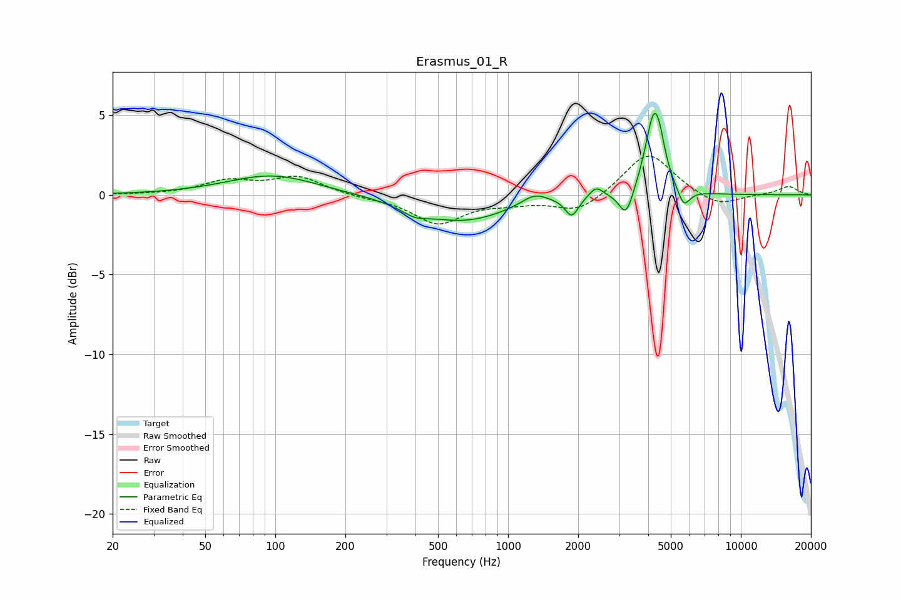

# Erasmus_01_R
See [usage instructions](https://github.com/jaakkopasanen/AutoEq#usage) for more options and info.

### Parametric EQs
Apply preamp of -5.2 dB when using parametric equalizer.

|   # | Type    |   Fc (Hz) |    Q |   Gain (dB) |
|-----|---------|-----------|------|-------------|
|   1 | Peaking |        97 | 0.73 |         1.3 |
|   2 | Peaking |       396 | 2.6  |        -0.5 |
|   3 | Peaking |       637 | 0.71 |        -1.6 |
|   4 | Peaking |      1298 | 2.46 |         0.7 |
|   5 | Peaking |      1877 | 4.97 |        -1.2 |
|   6 | Peaking |      2388 | 4.81 |         0.7 |
|   7 | Peaking |      3213 | 4.75 |        -1.7 |
|   8 | Peaking |      4226 | 3.83 |         4.8 |
|   9 | Peaking |      4478 | 5.97 |         0.9 |
|  10 | Peaking |      5686 | 5.28 |        -1.2 |

### Fixed Band EQs
When using fixed band (also called graphic) equalizer, apply preamp of **-2.5 dB** (if available) and set gains manually with these parameters.

|   # | Type    |   Fc (Hz) |    Q |   Gain (dB) |
|-----|---------|-----------|------|-------------|
|   1 | Peaking |        31 | 1.41 |         0   |
|   2 | Peaking |        62 | 1.41 |         0.8 |
|   3 | Peaking |       125 | 1.41 |         1.1 |
|   4 | Peaking |       250 | 1.41 |        -0.2 |
|   5 | Peaking |       500 | 1.41 |        -1.8 |
|   6 | Peaking |      1000 | 1.41 |        -0.4 |
|   7 | Peaking |      2000 | 1.41 |        -1.1 |
|   8 | Peaking |      4000 | 1.41 |         2.7 |
|   9 | Peaking |      8000 | 1.41 |        -0.8 |
|  10 | Peaking |     16000 | 1.41 |         0.5 |

### Graphs

