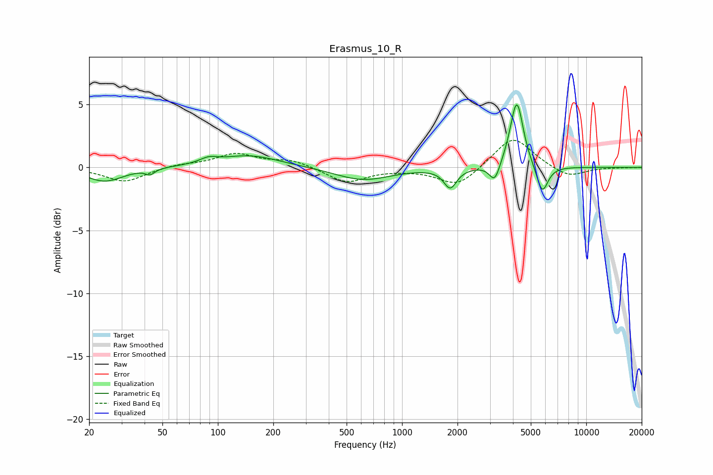

# Erasmus_10_R
See [usage instructions](https://github.com/jaakkopasanen/AutoEq#usage) for more options and info.

### Parametric EQs
Apply preamp of -5.1 dB when using parametric equalizer.

|   # | Type    |   Fc (Hz) |    Q |   Gain (dB) |
|-----|---------|-----------|------|-------------|
|   1 | Peaking |        24 | 1.42 |        -1.1 |
|   2 | Peaking |        43 | 5.99 |        -0.4 |
|   3 | Peaking |        89 | 3.07 |         0.4 |
|   4 | Peaking |       148 | 0.85 |         1   |
|   5 | Peaking |       612 | 0.95 |        -1   |
|   6 | Peaking |      1826 | 4.11 |        -1.5 |
|   7 | Peaking |      3185 | 4.94 |        -1.5 |
|   8 | Peaking |      4116 | 3.16 |         1   |
|   9 | Peaking |      4205 | 4.25 |         4.4 |
|  10 | Peaking |      5767 | 4.41 |        -2.3 |

### Fixed Band EQs
When using fixed band (also called graphic) equalizer, apply preamp of **-2.3 dB** (if available) and set gains manually with these parameters.

|   # | Type    |   Fc (Hz) |    Q |   Gain (dB) |
|-----|---------|-----------|------|-------------|
|   1 | Peaking |        31 | 1.41 |        -1.1 |
|   2 | Peaking |        62 | 1.41 |         0.2 |
|   3 | Peaking |       125 | 1.41 |         1   |
|   4 | Peaking |       250 | 1.41 |         0.6 |
|   5 | Peaking |       500 | 1.41 |        -1.2 |
|   6 | Peaking |      1000 | 1.41 |        -0.1 |
|   7 | Peaking |      2000 | 1.41 |        -1.5 |
|   8 | Peaking |      4000 | 1.41 |         2.5 |
|   9 | Peaking |      8000 | 1.41 |        -0.8 |
|  10 | Peaking |     16000 | 1.41 |        -0   |

### Graphs

