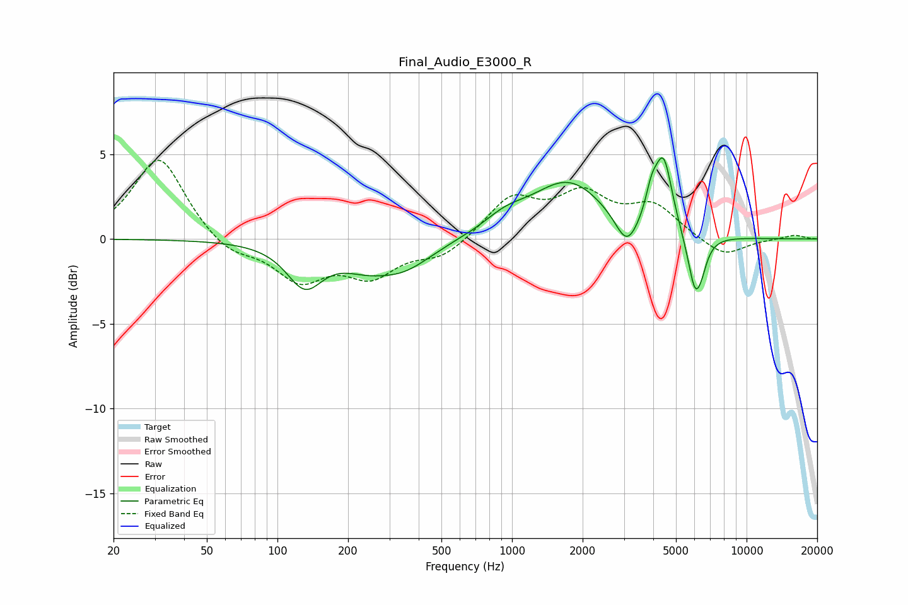

# Final_Audio_E3000_R
See [usage instructions](https://github.com/jaakkopasanen/AutoEq#usage) for more options and info.

### Parametric EQs
Apply preamp of -4.9 dB when using parametric equalizer.

|   # | Type    |   Fc (Hz) |    Q |   Gain (dB) |
|-----|---------|-----------|------|-------------|
|   1 | Peaking |       131 | 1.84 |        -2.5 |
|   2 | Peaking |       235 | 1.33 |        -0.9 |
|   3 | Peaking |       344 | 1.1  |        -1.6 |
|   4 | Peaking |       936 | 1.55 |         0.8 |
|   5 | Peaking |      1736 | 0.9  |         3.3 |
|   6 | Peaking |      3084 | 2.93 |        -1.9 |
|   7 | Peaking |      3936 | 5.4  |         1.5 |
|   8 | Peaking |      4430 | 3.78 |         4.2 |
|   9 | Peaking |      6041 | 4.26 |        -3.4 |
|  10 | Peaking |      6470 | 6    |        -0.6 |

### Fixed Band EQs
When using fixed band (also called graphic) equalizer, apply preamp of **-4.7 dB** (if available) and set gains manually with these parameters.

|   # | Type    |   Fc (Hz) |    Q |   Gain (dB) |
|-----|---------|-----------|------|-------------|
|   1 | Peaking |        31 | 1.41 |         4.9 |
|   2 | Peaking |        62 | 1.41 |        -1   |
|   3 | Peaking |       125 | 1.41 |        -2.3 |
|   4 | Peaking |       250 | 1.41 |        -2   |
|   5 | Peaking |       500 | 1.41 |        -1   |
|   6 | Peaking |      1000 | 1.41 |         2.3 |
|   7 | Peaking |      2000 | 1.41 |         2.4 |
|   8 | Peaking |      4000 | 1.41 |         1.8 |
|   9 | Peaking |      8000 | 1.41 |        -1.1 |
|  10 | Peaking |     16000 | 1.41 |         0.2 |

### Graphs

