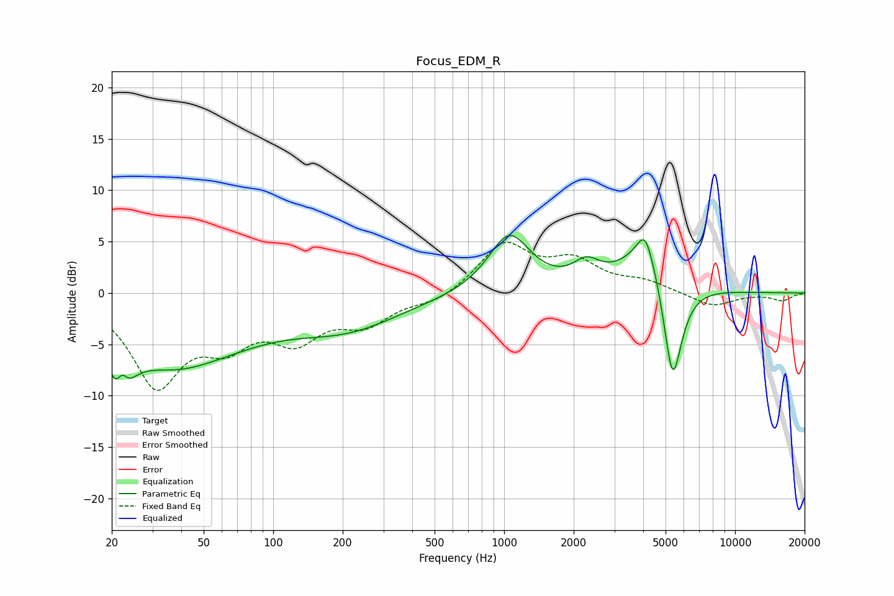

# Focus_EDM_R
See [usage instructions](https://github.com/jaakkopasanen/AutoEq#usage) for more options and info.

### Parametric EQs
Apply preamp of -5.7 dB when using parametric equalizer.

|   # | Type    |   Fc (Hz) |    Q |   Gain (dB) |
|-----|---------|-----------|------|-------------|
|   1 | Peaking |        22 | 3.18 |        -6   |
|   2 | Peaking |        22 | 5.99 |         3.1 |
|   3 | Peaking |        40 | 0.49 |        -7.3 |
|   4 | Peaking |        51 | 0.94 |         0.5 |
|   5 | Peaking |       210 | 0.6  |        -3   |
|   6 | Peaking |      1053 | 1.56 |         5.7 |
|   7 | Peaking |      2272 | 2.45 |         1.9 |
|   8 | Peaking |      4079 | 4.23 |         2.5 |
|   9 | Peaking |      4242 | 1.29 |         5   |
|  10 | Peaking |      5363 | 3.17 |       -11.4 |

### Fixed Band EQs
When using fixed band (also called graphic) equalizer, apply preamp of **-5.0 dB** (if available) and set gains manually with these parameters.

|   # | Type    |   Fc (Hz) |    Q |   Gain (dB) |
|-----|---------|-----------|------|-------------|
|   1 | Peaking |        31 | 1.41 |        -8.6 |
|   2 | Peaking |        62 | 1.41 |        -3.9 |
|   3 | Peaking |       125 | 1.41 |        -3.9 |
|   4 | Peaking |       250 | 1.41 |        -2.6 |
|   5 | Peaking |       500 | 1.41 |        -0.9 |
|   6 | Peaking |      1000 | 1.41 |         4.7 |
|   7 | Peaking |      2000 | 1.41 |         2.8 |
|   8 | Peaking |      4000 | 1.41 |         1   |
|   9 | Peaking |      8000 | 1.41 |        -1.3 |
|  10 | Peaking |     16000 | 1.41 |        -0.7 |

### Graphs

