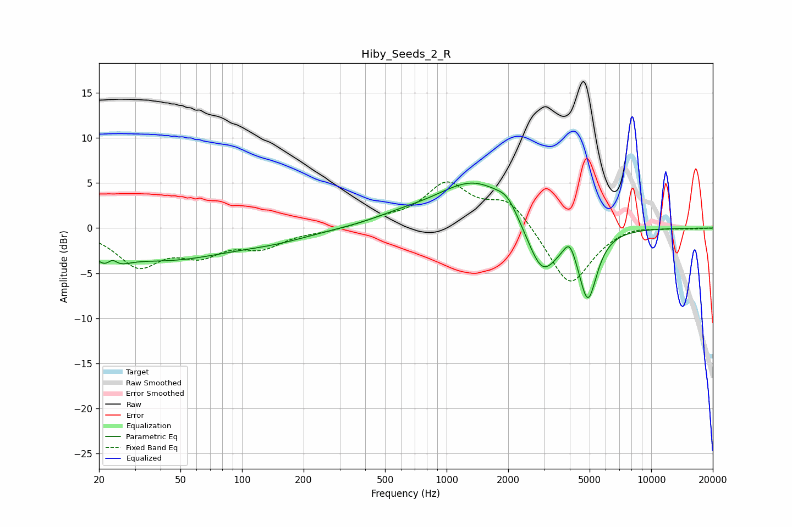

# Hiby_Seeds_2_R
See [usage instructions](https://github.com/jaakkopasanen/AutoEq#usage) for more options and info.

### Parametric EQs
Apply preamp of -5.1 dB when using parametric equalizer.

|   # | Type    |   Fc (Hz) |    Q |   Gain (dB) |
|-----|---------|-----------|------|-------------|
|   1 | Peaking |        23 | 2.68 |        -3.2 |
|   2 | Peaking |        23 | 4.72 |         2.1 |
|   3 | Peaking |        42 | 0.43 |        -3.3 |
|   4 | Peaking |       149 | 0.78 |        -0.8 |
|   5 | Peaking |       582 | 1.11 |         0.5 |
|   6 | Peaking |      1400 | 0.71 |         5.4 |
|   7 | Peaking |      1981 | 3    |         1.2 |
|   8 | Peaking |      2925 | 1.77 |        -6.2 |
|   9 | Peaking |      3995 | 4.85 |         1.9 |
|  10 | Peaking |      4903 | 3.09 |        -7.7 |

### Fixed Band EQs
When using fixed band (also called graphic) equalizer, apply preamp of **-5.2 dB** (if available) and set gains manually with these parameters.

|   # | Type    |   Fc (Hz) |    Q |   Gain (dB) |
|-----|---------|-----------|------|-------------|
|   1 | Peaking |        31 | 1.41 |        -4   |
|   2 | Peaking |        62 | 1.41 |        -2.5 |
|   3 | Peaking |       125 | 1.41 |        -1.9 |
|   4 | Peaking |       250 | 1.41 |        -0.3 |
|   5 | Peaking |       500 | 1.41 |         0.8 |
|   6 | Peaking |      1000 | 1.41 |         4.7 |
|   7 | Peaking |      2000 | 1.41 |         3.1 |
|   8 | Peaking |      4000 | 1.41 |        -6.6 |
|   9 | Peaking |      8000 | 1.41 |         0.5 |
|  10 | Peaking |     16000 | 1.41 |        -0.1 |

### Graphs

