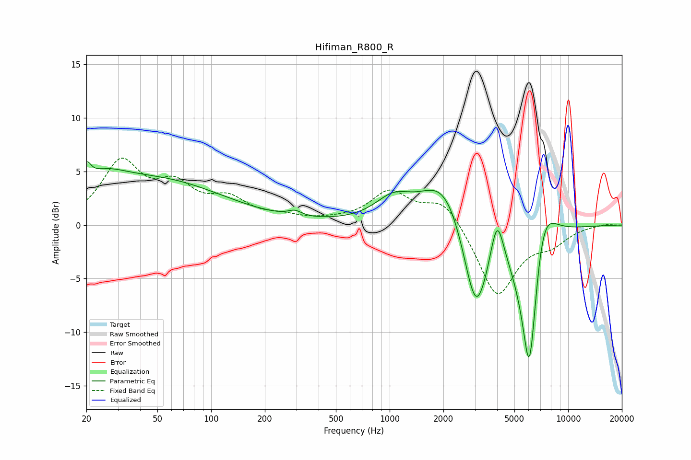

# Hifiman_R800_R
See [usage instructions](https://github.com/jaakkopasanen/AutoEq#usage) for more options and info.

### Parametric EQs
Apply preamp of -6.0 dB when using parametric equalizer.

|   # | Type    |   Fc (Hz) |    Q |   Gain (dB) |
|-----|---------|-----------|------|-------------|
|   1 | Peaking |        20 | 6    |         1.7 |
|   2 | Peaking |        24 | 1.07 |         2.2 |
|   3 | Peaking |        52 | 0.39 |         3.9 |
|   4 | Peaking |       294 | 3.84 |         0.5 |
|   5 | Peaking |      1044 | 1.41 |         2   |
|   6 | Peaking |      2060 | 1.06 |         5.1 |
|   7 | Peaking |      3040 | 1.87 |        -9.6 |
|   8 | Peaking |      3998 | 3.77 |         4.6 |
|   9 | Peaking |      6074 | 2.56 |       -16.5 |
|  10 | Peaking |      7136 | 1.85 |         6.6 |

### Fixed Band EQs
When using fixed band (also called graphic) equalizer, apply preamp of **-6.3 dB** (if available) and set gains manually with these parameters.

|   # | Type    |   Fc (Hz) |    Q |   Gain (dB) |
|-----|---------|-----------|------|-------------|
|   1 | Peaking |        31 | 1.41 |         5.6 |
|   2 | Peaking |        62 | 1.41 |         3.1 |
|   3 | Peaking |       125 | 1.41 |         2   |
|   4 | Peaking |       250 | 1.41 |         0.6 |
|   5 | Peaking |       500 | 1.41 |         0.2 |
|   6 | Peaking |      1000 | 1.41 |         3   |
|   7 | Peaking |      2000 | 1.41 |         2.5 |
|   8 | Peaking |      4000 | 1.41 |        -6.7 |
|   9 | Peaking |      8000 | 1.41 |        -1.4 |
|  10 | Peaking |     16000 | 1.41 |         0.1 |

### Graphs

