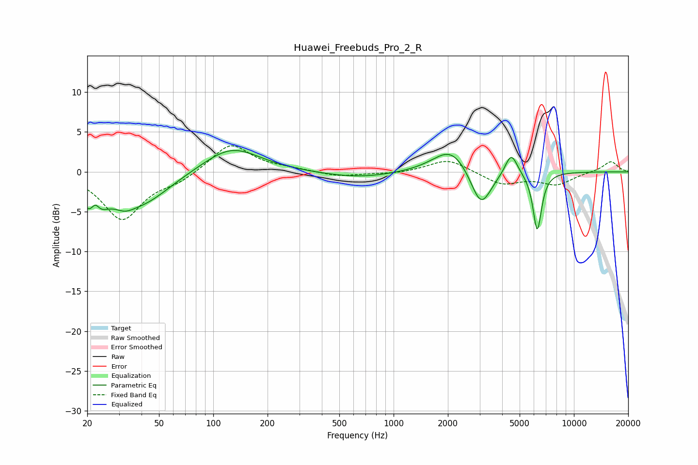

# Huawei_Freebuds_Pro_2_R
See [usage instructions](https://github.com/jaakkopasanen/AutoEq#usage) for more options and info.

### Parametric EQs
Apply preamp of -2.8 dB when using parametric equalizer.

|   # | Type    |   Fc (Hz) |    Q |   Gain (dB) |
|-----|---------|-----------|------|-------------|
|   1 | Peaking |        22 | 2.34 |        -4.7 |
|   2 | Peaking |        22 | 5.81 |         2.1 |
|   3 | Peaking |        32 | 2.57 |        -1.2 |
|   4 | Peaking |        41 | 0.92 |        -3.7 |
|   5 | Peaking |       126 | 0.91 |         3.2 |
|   6 | Peaking |       638 | 0.71 |        -0.8 |
|   7 | Peaking |      2093 | 1.41 |         3.3 |
|   8 | Peaking |      3050 | 2.41 |        -5   |
|   9 | Peaking |      4491 | 4.15 |         2.8 |
|  10 | Peaking |      6263 | 5.71 |        -7.4 |

### Fixed Band EQs
When using fixed band (also called graphic) equalizer, apply preamp of **-3.4 dB** (if available) and set gains manually with these parameters.

|   # | Type    |   Fc (Hz) |    Q |   Gain (dB) |
|-----|---------|-----------|------|-------------|
|   1 | Peaking |        31 | 1.41 |        -5.9 |
|   2 | Peaking |        62 | 1.41 |        -1   |
|   3 | Peaking |       125 | 1.41 |         3.6 |
|   4 | Peaking |       250 | 1.41 |         0.3 |
|   5 | Peaking |       500 | 1.41 |        -0.6 |
|   6 | Peaking |      1000 | 1.41 |        -0.3 |
|   7 | Peaking |      2000 | 1.41 |         1.7 |
|   8 | Peaking |      4000 | 1.41 |        -1.6 |
|   9 | Peaking |      8000 | 1.41 |        -1.5 |
|  10 | Peaking |     16000 | 1.41 |         1.3 |

### Graphs

