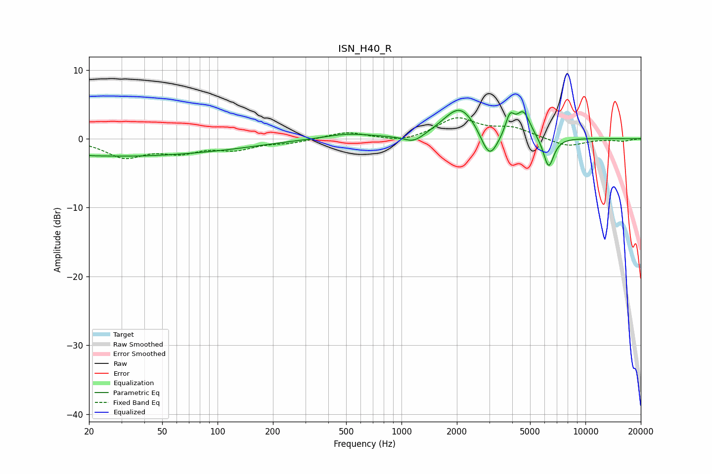

# ISN_H40_R
See [usage instructions](https://github.com/jaakkopasanen/AutoEq#usage) for more options and info.

### Parametric EQs
Apply preamp of -4.2 dB when using parametric equalizer.

|   # | Type    |   Fc (Hz) |    Q |   Gain (dB) |
|-----|---------|-----------|------|-------------|
|   1 | Peaking |        21 | 5.57 |        -0   |
|   2 | Peaking |        28 | 0.28 |        -2.5 |
|   3 | Peaking |       123 | 0.62 |        -0.5 |
|   4 | Peaking |       510 | 1.15 |         0.7 |
|   5 | Peaking |      1168 | 2.51 |        -1.2 |
|   6 | Peaking |      2087 | 1.54 |         4.8 |
|   7 | Peaking |      3004 | 3.03 |        -4.3 |
|   8 | Peaking |      3884 | 5.97 |         2.8 |
|   9 | Peaking |      4598 | 3.65 |         3.7 |
|  10 | Peaking |      6308 | 4.79 |        -4.5 |

### Fixed Band EQs
When using fixed band (also called graphic) equalizer, apply preamp of **-3.1 dB** (if available) and set gains manually with these parameters.

|   # | Type    |   Fc (Hz) |    Q |   Gain (dB) |
|-----|---------|-----------|------|-------------|
|   1 | Peaking |        31 | 1.41 |        -2.5 |
|   2 | Peaking |        62 | 1.41 |        -1.7 |
|   3 | Peaking |       125 | 1.41 |        -1.3 |
|   4 | Peaking |       250 | 1.41 |        -0.5 |
|   5 | Peaking |       500 | 1.41 |         1   |
|   6 | Peaking |      1000 | 1.41 |        -0.6 |
|   7 | Peaking |      2000 | 1.41 |         2.9 |
|   8 | Peaking |      4000 | 1.41 |         1.4 |
|   9 | Peaking |      8000 | 1.41 |        -1.2 |
|  10 | Peaking |     16000 | 1.41 |        -0.3 |

### Graphs

