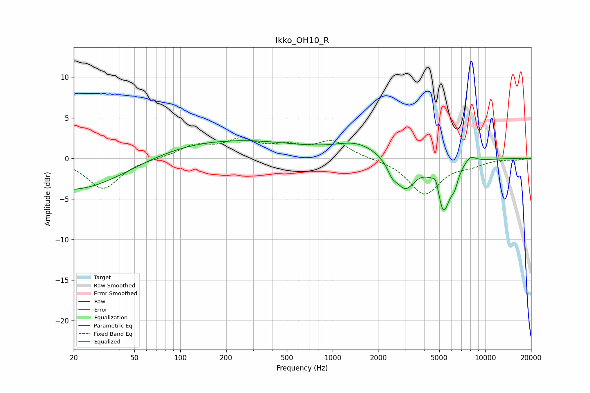

# Ikko_OH10_R
See [usage instructions](https://github.com/jaakkopasanen/AutoEq#usage) for more options and info.

### Parametric EQs
Apply preamp of -2.3 dB when using parametric equalizer.

|   # | Type    |   Fc (Hz) |    Q |   Gain (dB) |
|-----|---------|-----------|------|-------------|
|   1 | Peaking |        20 | 0.42 |        -4.1 |
|   2 | Peaking |       199 | 0.29 |         2.3 |
|   3 | Peaking |       213 | 1.34 |        -0   |
|   4 | Peaking |      1461 | 0.97 |         1.7 |
|   5 | Peaking |      2452 | 4.67 |        -1.1 |
|   6 | Peaking |      2986 | 2.13 |        -3.7 |
|   7 | Peaking |      4771 | 6    |         1.9 |
|   8 | Peaking |      5306 | 3    |        -6.5 |
|   9 | Peaking |      6307 | 5.94 |        -1.4 |
|  10 | Peaking |      7983 | 3.62 |         0.9 |

### Fixed Band EQs
When using fixed band (also called graphic) equalizer, apply preamp of **-2.6 dB** (if available) and set gains manually with these parameters.

|   # | Type    |   Fc (Hz) |    Q |   Gain (dB) |
|-----|---------|-----------|------|-------------|
|   1 | Peaking |        31 | 1.41 |        -3.8 |
|   2 | Peaking |        62 | 1.41 |        -0   |
|   3 | Peaking |       125 | 1.41 |         1.5 |
|   4 | Peaking |       250 | 1.41 |         2   |
|   5 | Peaking |       500 | 1.41 |         1.2 |
|   6 | Peaking |      1000 | 1.41 |         2   |
|   7 | Peaking |      2000 | 1.41 |        -0   |
|   8 | Peaking |      4000 | 1.41 |        -4.4 |
|   9 | Peaking |      8000 | 1.41 |        -0.7 |
|  10 | Peaking |     16000 | 1.41 |        -0.2 |

### Graphs

