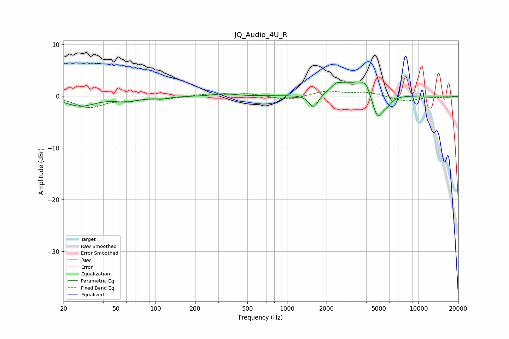

# JQ_Audio_4U_R
See [usage instructions](https://github.com/jaakkopasanen/AutoEq#usage) for more options and info.

### Parametric EQs
Apply preamp of -2.8 dB when using parametric equalizer.

|   # | Type    |   Fc (Hz) |    Q |   Gain (dB) |
|-----|---------|-----------|------|-------------|
|   1 | Peaking |        27 | 1.28 |        -1.9 |
|   2 | Peaking |        61 | 1.71 |        -0.8 |
|   3 | Peaking |       111 | 2.83 |        -0.4 |
|   4 | Peaking |       334 | 1.86 |         0.5 |
|   5 | Peaking |      1595 | 3.96 |        -2.7 |
|   6 | Peaking |      2371 | 4.2  |         1   |
|   7 | Peaking |      3110 | 1.15 |         2.7 |
|   8 | Peaking |      3961 | 4.26 |         1.9 |
|   9 | Peaking |      4876 | 3.37 |        -4.9 |
|  10 | Peaking |      5784 | 3.91 |        -1.2 |

### Fixed Band EQs
When using fixed band (also called graphic) equalizer, apply preamp of **-1.1 dB** (if available) and set gains manually with these parameters.

|   # | Type    |   Fc (Hz) |    Q |   Gain (dB) |
|-----|---------|-----------|------|-------------|
|   1 | Peaking |        31 | 1.41 |        -2.1 |
|   2 | Peaking |        62 | 1.41 |        -0.6 |
|   3 | Peaking |       125 | 1.41 |        -0.4 |
|   4 | Peaking |       250 | 1.41 |         0.4 |
|   5 | Peaking |       500 | 1.41 |         0.5 |
|   6 | Peaking |      1000 | 1.41 |        -0.8 |
|   7 | Peaking |      2000 | 1.41 |         1   |
|   8 | Peaking |      4000 | 1.41 |         0.8 |
|   9 | Peaking |      8000 | 1.41 |        -1   |
|  10 | Peaking |     16000 | 1.41 |        -0.3 |

### Graphs

