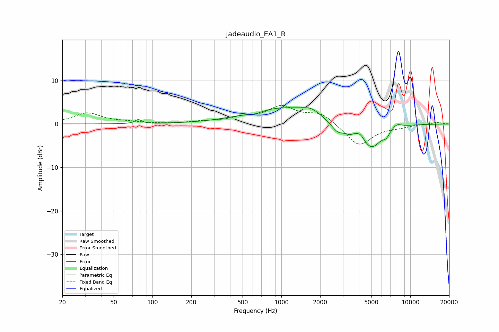

# Jadeaudio_EA1_R
See [usage instructions](https://github.com/jaakkopasanen/AutoEq#usage) for more options and info.

### Parametric EQs
Apply preamp of -3.8 dB when using parametric equalizer.

|   # | Type    |   Fc (Hz) |    Q |   Gain (dB) |
|-----|---------|-----------|------|-------------|
|   1 | Peaking |        78 | 5.86 |         0.9 |
|   2 | Peaking |       631 | 2.85 |        -0.5 |
|   3 | Peaking |      1025 | 0.52 |         3.7 |
|   4 | Peaking |      1699 | 2.15 |         1.3 |
|   5 | Peaking |      2751 | 2.5  |        -2.6 |
|   6 | Peaking |      3368 | 5.16 |        -0.8 |
|   7 | Peaking |      4099 | 5.33 |         0.9 |
|   8 | Peaking |      4994 | 1.75 |        -5.6 |
|   9 | Peaking |      6503 | 5.49 |        -1.2 |
|  10 | Peaking |      7850 | 3.61 |         1   |

### Fixed Band EQs
When using fixed band (also called graphic) equalizer, apply preamp of **-4.4 dB** (if available) and set gains manually with these parameters.

|   # | Type    |   Fc (Hz) |    Q |   Gain (dB) |
|-----|---------|-----------|------|-------------|
|   1 | Peaking |        31 | 1.41 |         2.5 |
|   2 | Peaking |        62 | 1.41 |         0.4 |
|   3 | Peaking |       125 | 1.41 |        -0   |
|   4 | Peaking |       250 | 1.41 |         0.5 |
|   5 | Peaking |       500 | 1.41 |         1.2 |
|   6 | Peaking |      1000 | 1.41 |         3.8 |
|   7 | Peaking |      2000 | 1.41 |         2.5 |
|   8 | Peaking |      4000 | 1.41 |        -5.1 |
|   9 | Peaking |      8000 | 1.41 |        -0.5 |
|  10 | Peaking |     16000 | 1.41 |         0.4 |

### Graphs

