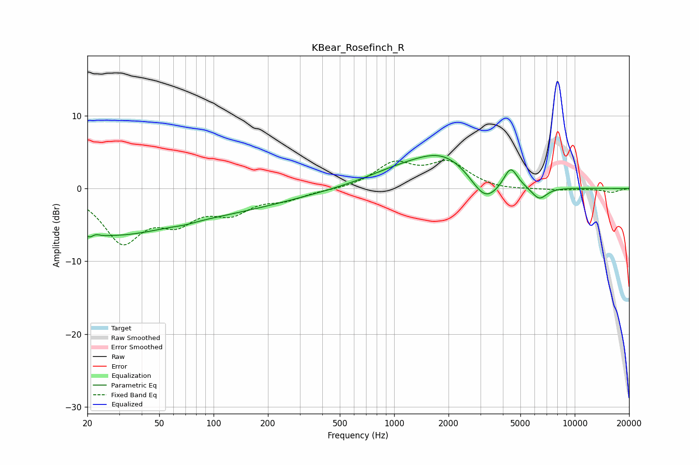

# KBear_Rosefinch_R
See [usage instructions](https://github.com/jaakkopasanen/AutoEq#usage) for more options and info.

### Parametric EQs
Apply preamp of -4.6 dB when using parametric equalizer.

|   # | Type    |   Fc (Hz) |    Q |   Gain (dB) |
|-----|---------|-----------|------|-------------|
|   1 | Peaking |        21 | 3.82 |        -4.5 |
|   2 | Peaking |        22 | 4.49 |         3.7 |
|   3 | Peaking |        26 | 0.49 |        -5   |
|   4 | Peaking |        70 | 2.61 |        -0.2 |
|   5 | Peaking |       100 | 0.34 |        -2.8 |
|   6 | Peaking |      1035 | 0.71 |         1.6 |
|   7 | Peaking |      1897 | 0.81 |         4.2 |
|   8 | Peaking |      3184 | 1.79 |        -3.6 |
|   9 | Peaking |      4418 | 3.71 |         2.9 |
|  10 | Peaking |      6355 | 3.16 |        -1.8 |

### Fixed Band EQs
When using fixed band (also called graphic) equalizer, apply preamp of **-4.0 dB** (if available) and set gains manually with these parameters.

|   # | Type    |   Fc (Hz) |    Q |   Gain (dB) |
|-----|---------|-----------|------|-------------|
|   1 | Peaking |        31 | 1.41 |        -6.9 |
|   2 | Peaking |        62 | 1.41 |        -3.7 |
|   3 | Peaking |       125 | 1.41 |        -2.8 |
|   4 | Peaking |       250 | 1.41 |        -1.2 |
|   5 | Peaking |       500 | 1.41 |        -0.1 |
|   6 | Peaking |      1000 | 1.41 |         3.3 |
|   7 | Peaking |      2000 | 1.41 |         3.3 |
|   8 | Peaking |      4000 | 1.41 |        -0.3 |
|   9 | Peaking |      8000 | 1.41 |        -0.2 |
|  10 | Peaking |     16000 | 1.41 |        -0.5 |

### Graphs

