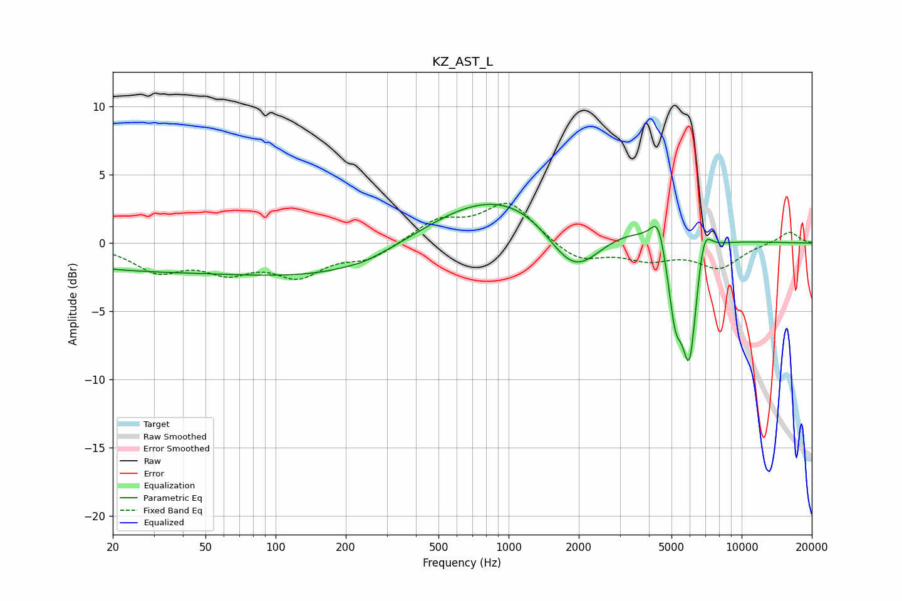

# KZ_AST_L
See [usage instructions](https://github.com/jaakkopasanen/AutoEq#usage) for more options and info.

### Parametric EQs
Apply preamp of -2.9 dB when using parametric equalizer.

|   # | Type    |   Fc (Hz) |    Q |   Gain (dB) |
|-----|---------|-----------|------|-------------|
|   1 | Peaking |        35 | 0.23 |        -2   |
|   2 | Peaking |        44 | 1.24 |         0   |
|   3 | Peaking |       241 | 2.96 |        -0.1 |
|   4 | Peaking |       266 | 0.43 |        -2.6 |
|   5 | Peaking |      1062 | 0.3  |         5.3 |
|   6 | Peaking |      1913 | 1.07 |        -5.6 |
|   7 | Peaking |      4383 | 4.54 |         2.2 |
|   8 | Peaking |      5186 | 4.47 |        -5   |
|   9 | Peaking |      5974 | 4.18 |        -8.7 |
|  10 | Peaking |      6877 | 4.46 |         2.6 |

### Fixed Band EQs
When using fixed band (also called graphic) equalizer, apply preamp of **-3.0 dB** (if available) and set gains manually with these parameters.

|   # | Type    |   Fc (Hz) |    Q |   Gain (dB) |
|-----|---------|-----------|------|-------------|
|   1 | Peaking |        31 | 1.41 |        -1.9 |
|   2 | Peaking |        62 | 1.41 |        -1.7 |
|   3 | Peaking |       125 | 1.41 |        -2.2 |
|   4 | Peaking |       250 | 1.41 |        -1.1 |
|   5 | Peaking |       500 | 1.41 |         1.6 |
|   6 | Peaking |      1000 | 1.41 |         2.9 |
|   7 | Peaking |      2000 | 1.41 |        -1.4 |
|   8 | Peaking |      4000 | 1.41 |        -1.1 |
|   9 | Peaking |      8000 | 1.41 |        -1.7 |
|  10 | Peaking |     16000 | 1.41 |         0.9 |

### Graphs

