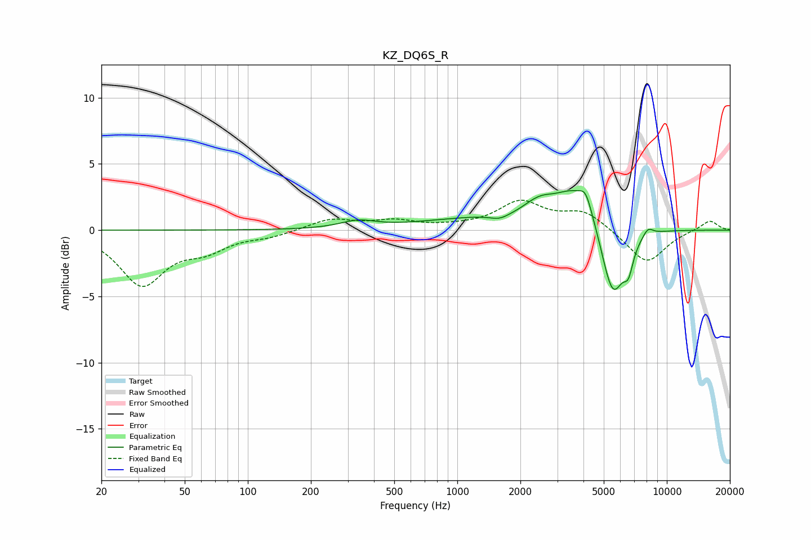

# KZ_DQ6S_R
See [usage instructions](https://github.com/jaakkopasanen/AutoEq#usage) for more options and info.

### Parametric EQs
Apply preamp of -3.1 dB when using parametric equalizer.

|   # | Type    |   Fc (Hz) |    Q |   Gain (dB) |
|-----|---------|-----------|------|-------------|
|   1 | Peaking |       335 | 1.73 |         0.6 |
|   2 | Peaking |      1211 | 0.51 |         0.8 |
|   3 | Peaking |      1594 | 3.15 |        -0.4 |
|   4 | Peaking |      2412 | 3.4  |        -0.5 |
|   5 | Peaking |      2424 | 2.56 |         1.4 |
|   6 | Peaking |      3727 | 1.22 |         3.2 |
|   7 | Peaking |      4103 | 5.12 |         1.1 |
|   8 | Peaking |      5513 | 2.41 |        -5.9 |
|   9 | Peaking |      6561 | 6    |        -1.7 |
|  10 | Peaking |      8128 | 5.31 |         0.6 |

### Fixed Band EQs
When using fixed band (also called graphic) equalizer, apply preamp of **-2.4 dB** (if available) and set gains manually with these parameters.

|   # | Type    |   Fc (Hz) |    Q |   Gain (dB) |
|-----|---------|-----------|------|-------------|
|   1 | Peaking |        31 | 1.41 |        -4   |
|   2 | Peaking |        62 | 1.41 |        -1.2 |
|   3 | Peaking |       125 | 1.41 |        -0.4 |
|   4 | Peaking |       250 | 1.41 |         0.8 |
|   5 | Peaking |       500 | 1.41 |         0.6 |
|   6 | Peaking |      1000 | 1.41 |         0.1 |
|   7 | Peaking |      2000 | 1.41 |         2   |
|   8 | Peaking |      4000 | 1.41 |         1.4 |
|   9 | Peaking |      8000 | 1.41 |        -2.5 |
|  10 | Peaking |     16000 | 1.41 |         0.8 |

### Graphs

