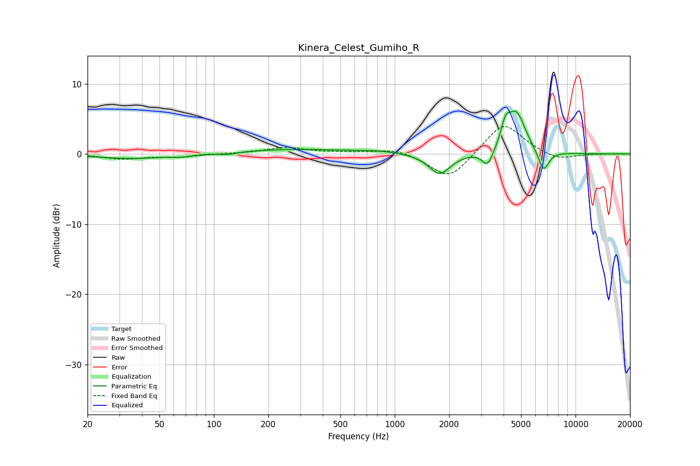

# Kinera_Celest_Gumiho_R
See [usage instructions](https://github.com/jaakkopasanen/AutoEq#usage) for more options and info.

### Parametric EQs
Apply preamp of -6.2 dB when using parametric equalizer.

|   # | Type    |   Fc (Hz) |    Q |   Gain (dB) |
|-----|---------|-----------|------|-------------|
|   1 | Peaking |        35 | 0.79 |        -0.7 |
|   2 | Peaking |        67 | 2.56 |        -0.3 |
|   3 | Peaking |       120 | 3.13 |        -0.3 |
|   4 | Peaking |       282 | 0.45 |         0.7 |
|   5 | Peaking |       816 | 1.28 |         0.3 |
|   6 | Peaking |      1772 | 2.39 |        -3   |
|   7 | Peaking |      3268 | 4.62 |        -2.4 |
|   8 | Peaking |      4098 | 6    |         2.6 |
|   9 | Peaking |      4698 | 2.72 |         5.8 |
|  10 | Peaking |      6644 | 4.58 |        -3.1 |

### Fixed Band EQs
When using fixed band (also called graphic) equalizer, apply preamp of **-4.0 dB** (if available) and set gains manually with these parameters.

|   # | Type    |   Fc (Hz) |    Q |   Gain (dB) |
|-----|---------|-----------|------|-------------|
|   1 | Peaking |        31 | 1.41 |        -0.7 |
|   2 | Peaking |        62 | 1.41 |        -0.4 |
|   3 | Peaking |       125 | 1.41 |         0   |
|   4 | Peaking |       250 | 1.41 |         0.9 |
|   5 | Peaking |       500 | 1.41 |         0.2 |
|   6 | Peaking |      1000 | 1.41 |         0.8 |
|   7 | Peaking |      2000 | 1.41 |        -3.8 |
|   8 | Peaking |      4000 | 1.41 |         4.7 |
|   9 | Peaking |      8000 | 1.41 |        -1   |
|  10 | Peaking |     16000 | 1.41 |         0   |

### Graphs

