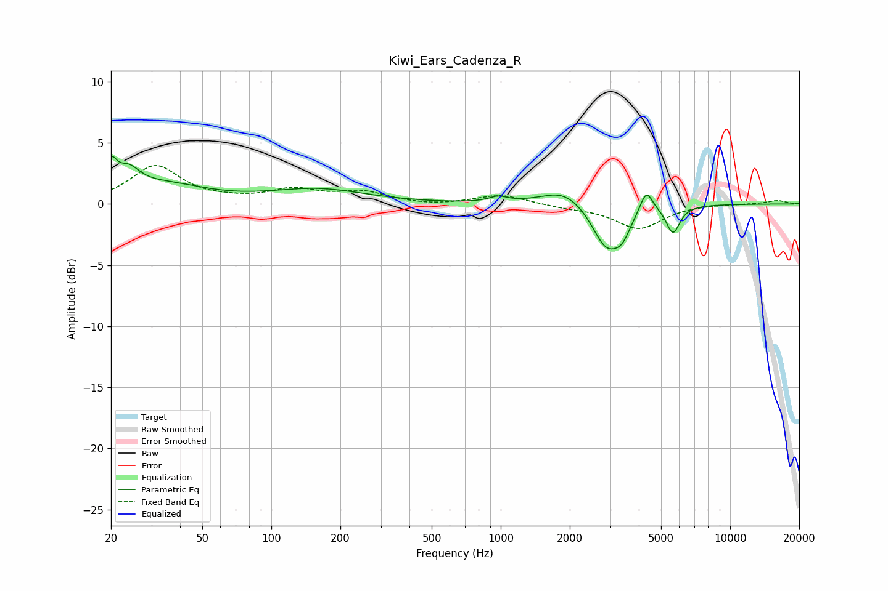

# Kiwi_Ears_Cadenza_R
See [usage instructions](https://github.com/jaakkopasanen/AutoEq#usage) for more options and info.

### Parametric EQs
Apply preamp of -4.0 dB when using parametric equalizer.

|   # | Type    |   Fc (Hz) |    Q |   Gain (dB) |
|-----|---------|-----------|------|-------------|
|   1 | Peaking |        20 | 5.85 |         2.1 |
|   2 | Peaking |        24 | 2.84 |         1.7 |
|   3 | Peaking |        34 | 0.79 |         1.5 |
|   4 | Peaking |       159 | 0.68 |         1.2 |
|   5 | Peaking |       974 | 3.67 |         0.4 |
|   6 | Peaking |      1897 | 1.46 |         1.3 |
|   7 | Peaking |      2889 | 2.24 |        -3.6 |
|   8 | Peaking |      3388 | 3.86 |        -1.4 |
|   9 | Peaking |      4312 | 5.1  |         1.9 |
|  10 | Peaking |      5637 | 4.83 |        -2.2 |

### Fixed Band EQs
When using fixed band (also called graphic) equalizer, apply preamp of **-3.2 dB** (if available) and set gains manually with these parameters.

|   # | Type    |   Fc (Hz) |    Q |   Gain (dB) |
|-----|---------|-----------|------|-------------|
|   1 | Peaking |        31 | 1.41 |         3.1 |
|   2 | Peaking |        62 | 1.41 |         0.2 |
|   3 | Peaking |       125 | 1.41 |         1.1 |
|   4 | Peaking |       250 | 1.41 |         0.9 |
|   5 | Peaking |       500 | 1.41 |        -0.2 |
|   6 | Peaking |      1000 | 1.41 |         0.8 |
|   7 | Peaking |      2000 | 1.41 |        -0.2 |
|   8 | Peaking |      4000 | 1.41 |        -2   |
|   9 | Peaking |      8000 | 1.41 |         0   |
|  10 | Peaking |     16000 | 1.41 |         0.3 |

### Graphs

