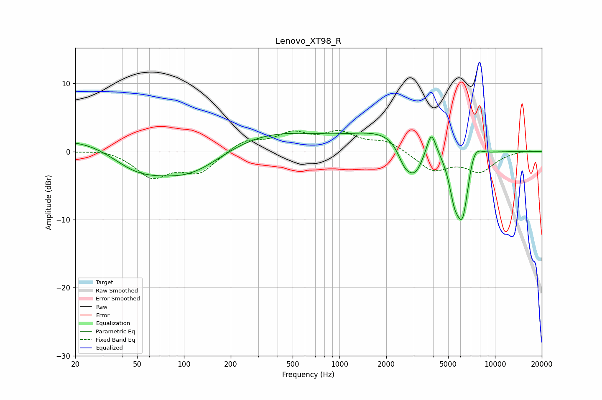

# Lenovo_XT98_R
See [usage instructions](https://github.com/jaakkopasanen/AutoEq#usage) for more options and info.

### Parametric EQs
Apply preamp of -2.8 dB when using parametric equalizer.

|   # | Type    |   Fc (Hz) |    Q |   Gain (dB) |
|-----|---------|-----------|------|-------------|
|   1 | Peaking |        49 | 0.7  |        -4.8 |
|   2 | Peaking |        99 | 0.18 |         7   |
|   3 | Peaking |       110 | 0.5  |        -8.3 |
|   4 | Peaking |      2301 | 0.53 |         3.2 |
|   5 | Peaking |      2620 | 3.13 |        -2.7 |
|   6 | Peaking |      3070 | 2.46 |        -4.6 |
|   7 | Peaking |      3898 | 4.96 |         3.3 |
|   8 | Peaking |      5467 | 4.22 |        -3.8 |
|   9 | Peaking |      6192 | 2.88 |       -10.8 |
|  10 | Peaking |      7273 | 2.76 |         3.6 |

### Fixed Band EQs
When using fixed band (also called graphic) equalizer, apply preamp of **-3.2 dB** (if available) and set gains manually with these parameters.

|   # | Type    |   Fc (Hz) |    Q |   Gain (dB) |
|-----|---------|-----------|------|-------------|
|   1 | Peaking |        31 | 1.41 |         0.4 |
|   2 | Peaking |        62 | 1.41 |        -3.6 |
|   3 | Peaking |       125 | 1.41 |        -3   |
|   4 | Peaking |       250 | 1.41 |         1.7 |
|   5 | Peaking |       500 | 1.41 |         2.4 |
|   6 | Peaking |      1000 | 1.41 |         2.5 |
|   7 | Peaking |      2000 | 1.41 |         1.5 |
|   8 | Peaking |      4000 | 1.41 |        -2.7 |
|   9 | Peaking |      8000 | 1.41 |        -2.8 |
|  10 | Peaking |     16000 | 1.41 |         0.2 |

### Graphs

