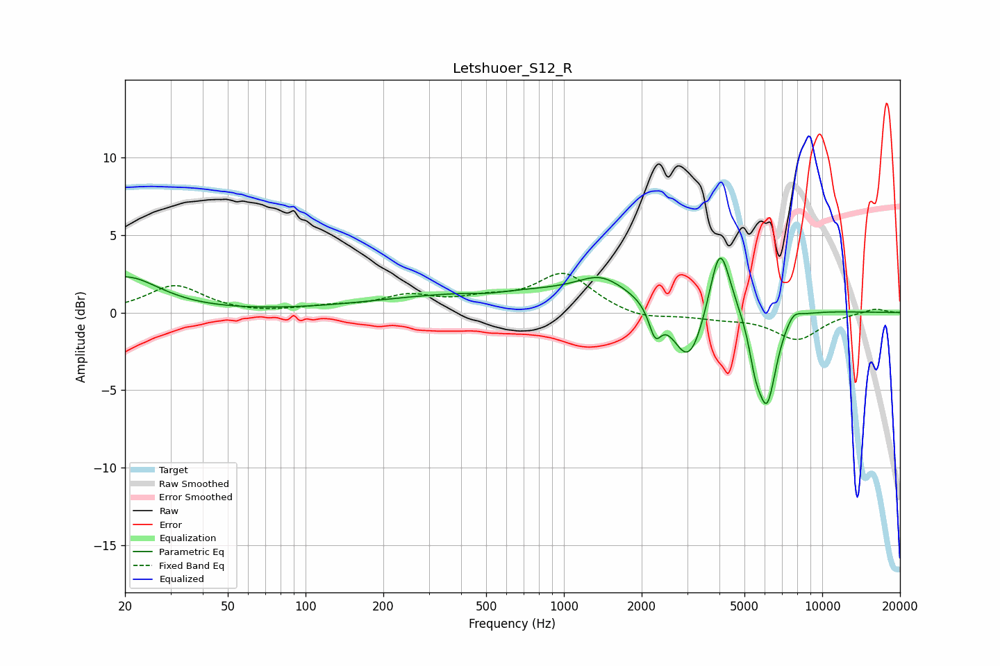

# Letshuoer_S12_R
See [usage instructions](https://github.com/jaakkopasanen/AutoEq#usage) for more options and info.

### Parametric EQs
Apply preamp of -3.6 dB when using parametric equalizer.

|   # | Type    |   Fc (Hz) |    Q |   Gain (dB) |
|-----|---------|-----------|------|-------------|
|   1 | Peaking |        20 | 1.08 |         2.3 |
|   2 | Peaking |       508 | 2.24 |        -0.2 |
|   3 | Peaking |      1012 | 0.18 |         1.5 |
|   4 | Peaking |      1389 | 1.64 |         1.1 |
|   5 | Peaking |      2255 | 5.93 |        -1.8 |
|   6 | Peaking |      3044 | 2.18 |        -4.4 |
|   7 | Peaking |      4012 | 3.53 |         4.8 |
|   8 | Peaking |      5494 | 5.88 |        -1.8 |
|   9 | Peaking |      6105 | 3.59 |        -6   |
|  10 | Peaking |      7730 | 4.54 |         0.6 |

### Fixed Band EQs
When using fixed band (also called graphic) equalizer, apply preamp of **-2.6 dB** (if available) and set gains manually with these parameters.

|   # | Type    |   Fc (Hz) |    Q |   Gain (dB) |
|-----|---------|-----------|------|-------------|
|   1 | Peaking |        31 | 1.41 |         1.7 |
|   2 | Peaking |        62 | 1.41 |        -0.1 |
|   3 | Peaking |       125 | 1.41 |         0.3 |
|   4 | Peaking |       250 | 1.41 |         1   |
|   5 | Peaking |       500 | 1.41 |         0.7 |
|   6 | Peaking |      1000 | 1.41 |         2.5 |
|   7 | Peaking |      2000 | 1.41 |        -0.5 |
|   8 | Peaking |      4000 | 1.41 |        -0.3 |
|   9 | Peaking |      8000 | 1.41 |        -1.7 |
|  10 | Peaking |     16000 | 1.41 |         0.3 |

### Graphs

