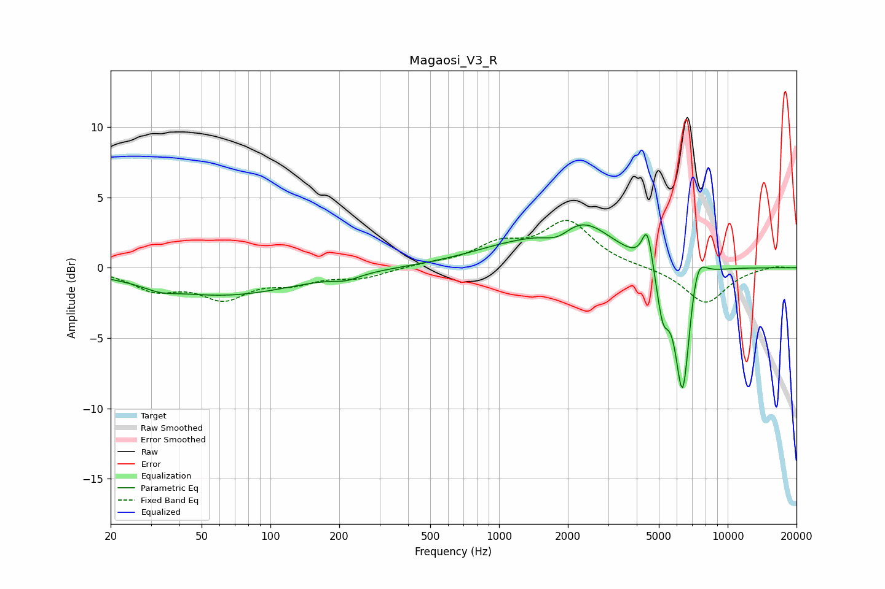

# Magaosi_V3_R
See [usage instructions](https://github.com/jaakkopasanen/AutoEq#usage) for more options and info.

### Parametric EQs
Apply preamp of -3.1 dB when using parametric equalizer.

|   # | Type    |   Fc (Hz) |    Q |   Gain (dB) |
|-----|---------|-----------|------|-------------|
|   1 | Peaking |        33 | 2.13 |        -0.4 |
|   2 | Peaking |        62 | 0.44 |        -1.9 |
|   3 | Peaking |       215 | 2.46 |        -0.4 |
|   4 | Peaking |      1134 | 0.66 |         1.1 |
|   5 | Peaking |      1820 | 2.15 |        -1.1 |
|   6 | Peaking |      2247 | 1    |         3.1 |
|   7 | Peaking |      4453 | 5.99 |         2.8 |
|   8 | Peaking |      5203 | 5.12 |        -3.1 |
|   9 | Peaking |      6356 | 4.11 |        -9.5 |
|  10 | Peaking |      7343 | 3.7  |         2.5 |

### Fixed Band EQs
When using fixed band (also called graphic) equalizer, apply preamp of **-3.5 dB** (if available) and set gains manually with these parameters.

|   # | Type    |   Fc (Hz) |    Q |   Gain (dB) |
|-----|---------|-----------|------|-------------|
|   1 | Peaking |        31 | 1.41 |        -1.4 |
|   2 | Peaking |        62 | 1.41 |        -2   |
|   3 | Peaking |       125 | 1.41 |        -0.9 |
|   4 | Peaking |       250 | 1.41 |        -0.7 |
|   5 | Peaking |       500 | 1.41 |         0.2 |
|   6 | Peaking |      1000 | 1.41 |         1.5 |
|   7 | Peaking |      2000 | 1.41 |         3.2 |
|   8 | Peaking |      4000 | 1.41 |         0   |
|   9 | Peaking |      8000 | 1.41 |        -2.5 |
|  10 | Peaking |     16000 | 1.41 |         0.2 |

### Graphs

