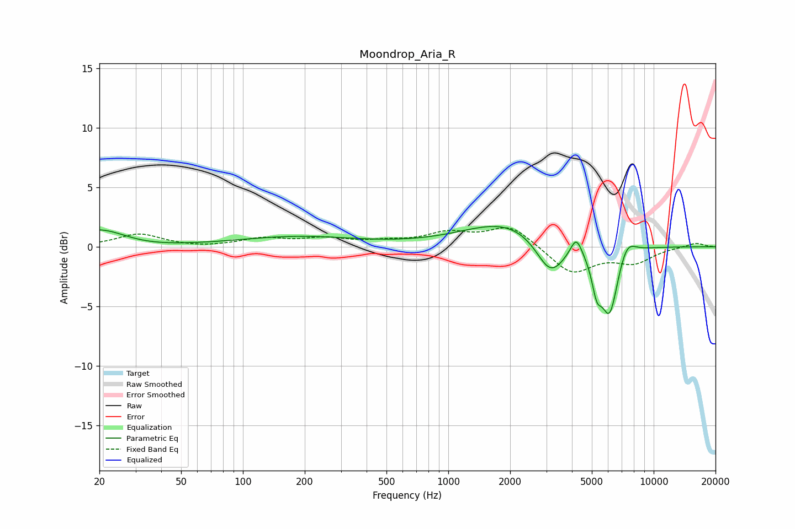

# Moondrop_Aria_R
See [usage instructions](https://github.com/jaakkopasanen/AutoEq#usage) for more options and info.

### Parametric EQs
Apply preamp of -1.8 dB when using parametric equalizer.

|   # | Type    |   Fc (Hz) |    Q |   Gain (dB) |
|-----|---------|-----------|------|-------------|
|   1 | Peaking |        20 | 1.05 |         1.5 |
|   2 | Peaking |        32 | 0.9  |        -0.2 |
|   3 | Peaking |       184 | 0.49 |         0.8 |
|   4 | Peaking |      1749 | 1.11 |        -0   |
|   5 | Peaking |      1950 | 0.68 |         2.2 |
|   6 | Peaking |      3142 | 1.99 |        -3.1 |
|   7 | Peaking |      4200 | 5.02 |         1.6 |
|   8 | Peaking |      5285 | 5.68 |        -2.5 |
|   9 | Peaking |      6099 | 3.33 |        -5.6 |
|  10 | Peaking |      7408 | 3.35 |         1.4 |

### Fixed Band EQs
When using fixed band (also called graphic) equalizer, apply preamp of **-1.7 dB** (if available) and set gains manually with these parameters.

|   # | Type    |   Fc (Hz) |    Q |   Gain (dB) |
|-----|---------|-----------|------|-------------|
|   1 | Peaking |        31 | 1.41 |         1.1 |
|   2 | Peaking |        62 | 1.41 |        -0.1 |
|   3 | Peaking |       125 | 1.41 |         0.6 |
|   4 | Peaking |       250 | 1.41 |         0.6 |
|   5 | Peaking |       500 | 1.41 |         0.3 |
|   6 | Peaking |      1000 | 1.41 |         1   |
|   7 | Peaking |      2000 | 1.41 |         1.8 |
|   8 | Peaking |      4000 | 1.41 |        -2.3 |
|   9 | Peaking |      8000 | 1.41 |        -1.2 |
|  10 | Peaking |     16000 | 1.41 |         0.4 |

### Graphs

