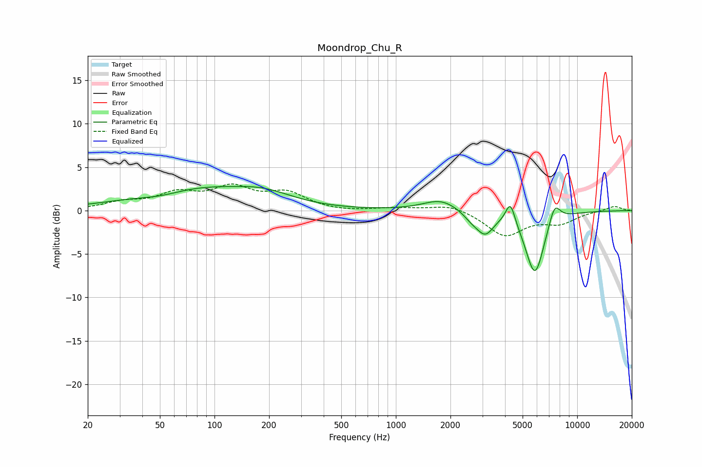

# Moondrop_Chu_R
See [usage instructions](https://github.com/jaakkopasanen/AutoEq#usage) for more options and info.

### Parametric EQs
Apply preamp of -2.9 dB when using parametric equalizer.

|   # | Type    |   Fc (Hz) |    Q |   Gain (dB) |
|-----|---------|-----------|------|-------------|
|   1 | Peaking |        51 | 0.99 |        -0.9 |
|   2 | Peaking |        72 | 0.44 |         2.7 |
|   3 | Peaking |       189 | 0.9  |         1.2 |
|   4 | Peaking |      1760 | 1.49 |         1.2 |
|   5 | Peaking |      2542 | 1.23 |         0.3 |
|   6 | Peaking |      2630 | 2.53 |        -1.1 |
|   7 | Peaking |      3117 | 2.95 |        -2.3 |
|   8 | Peaking |      4282 | 5.43 |         2.6 |
|   9 | Peaking |      5845 | 2.6  |        -7.4 |
|  10 | Peaking |      7498 | 4.13 |         2.4 |

### Fixed Band EQs
When using fixed band (also called graphic) equalizer, apply preamp of **-3.2 dB** (if available) and set gains manually with these parameters.

|   # | Type    |   Fc (Hz) |    Q |   Gain (dB) |
|-----|---------|-----------|------|-------------|
|   1 | Peaking |        31 | 1.41 |         0.8 |
|   2 | Peaking |        62 | 1.41 |         1.8 |
|   3 | Peaking |       125 | 1.41 |         2.4 |
|   4 | Peaking |       250 | 1.41 |         1.9 |
|   5 | Peaking |       500 | 1.41 |        -0.2 |
|   6 | Peaking |      1000 | 1.41 |         0.3 |
|   7 | Peaking |      2000 | 1.41 |         0.8 |
|   8 | Peaking |      4000 | 1.41 |        -2.9 |
|   9 | Peaking |      8000 | 1.41 |        -1.3 |
|  10 | Peaking |     16000 | 1.41 |         0.5 |

### Graphs

