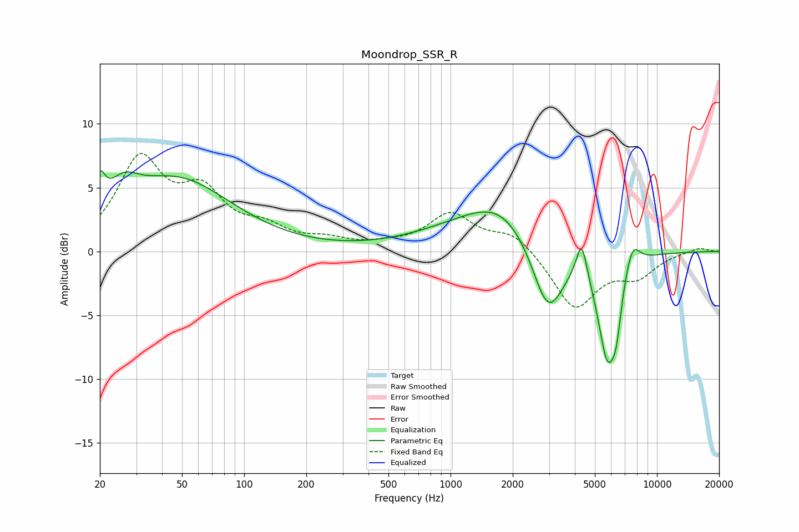

# Moondrop_SSR_R
See [usage instructions](https://github.com/jaakkopasanen/AutoEq#usage) for more options and info.

### Parametric EQs
Apply preamp of -6.4 dB when using parametric equalizer.

|   # | Type    |   Fc (Hz) |    Q |   Gain (dB) |
|-----|---------|-----------|------|-------------|
|   1 | Peaking |        20 | 5.8  |         2.5 |
|   2 | Peaking |        26 | 1.86 |         2.2 |
|   3 | Peaking |        47 | 0.53 |         5.5 |
|   4 | Peaking |      1065 | 0.58 |         1.2 |
|   5 | Peaking |      1776 | 0.84 |         3.1 |
|   6 | Peaking |      2961 | 1.82 |        -5.7 |
|   7 | Peaking |      4317 | 5.3  |         3   |
|   8 | Peaking |      5767 | 2.86 |        -8.1 |
|   9 | Peaking |      6360 | 6    |        -2.4 |
|  10 | Peaking |      7592 | 3.7  |         2.1 |

### Fixed Band EQs
When using fixed band (also called graphic) equalizer, apply preamp of **-7.8 dB** (if available) and set gains manually with these parameters.

|   # | Type    |   Fc (Hz) |    Q |   Gain (dB) |
|-----|---------|-----------|------|-------------|
|   1 | Peaking |        31 | 1.41 |         6.9 |
|   2 | Peaking |        62 | 1.41 |         4   |
|   3 | Peaking |       125 | 1.41 |         1.5 |
|   4 | Peaking |       250 | 1.41 |         0.7 |
|   5 | Peaking |       500 | 1.41 |         0.3 |
|   6 | Peaking |      1000 | 1.41 |         2.8 |
|   7 | Peaking |      2000 | 1.41 |         1.5 |
|   8 | Peaking |      4000 | 1.41 |        -4.4 |
|   9 | Peaking |      8000 | 1.41 |        -1.7 |
|  10 | Peaking |     16000 | 1.41 |         0.3 |

### Graphs

