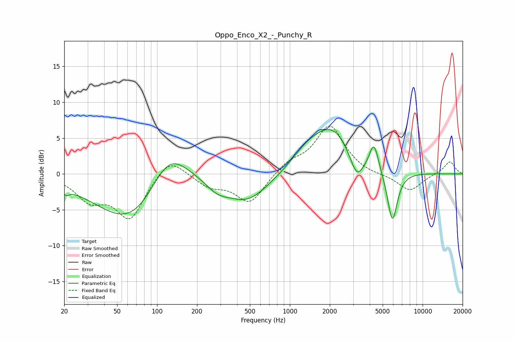

# Oppo_Enco_X2_-_Punchy_R
See [usage instructions](https://github.com/jaakkopasanen/AutoEq#usage) for more options and info.

### Parametric EQs
Apply preamp of -6.3 dB when using parametric equalizer.

|   # | Type    |   Fc (Hz) |    Q |   Gain (dB) |
|-----|---------|-----------|------|-------------|
|   1 | Peaking |        21 | 5.63 |        -0.8 |
|   2 | Peaking |        68 | 0.52 |        -8.2 |
|   3 | Peaking |       122 | 0.88 |         7.3 |
|   4 | Peaking |       284 | 1.7  |        -1.3 |
|   5 | Peaking |       478 | 0.86 |        -3.8 |
|   6 | Peaking |      1353 | 1.17 |         2.1 |
|   7 | Peaking |      2107 | 0.96 |         5.9 |
|   8 | Peaking |      3193 | 2.69 |        -3.5 |
|   9 | Peaking |      4301 | 4.15 |         3.8 |
|  10 | Peaking |      5915 | 3.59 |        -7.3 |

### Fixed Band EQs
When using fixed band (also called graphic) equalizer, apply preamp of **-6.8 dB** (if available) and set gains manually with these parameters.

|   # | Type    |   Fc (Hz) |    Q |   Gain (dB) |
|-----|---------|-----------|------|-------------|
|   1 | Peaking |        31 | 1.41 |        -3.2 |
|   2 | Peaking |        62 | 1.41 |        -6   |
|   3 | Peaking |       125 | 1.41 |         2.8 |
|   4 | Peaking |       250 | 1.41 |        -1.6 |
|   5 | Peaking |       500 | 1.41 |        -4.1 |
|   6 | Peaking |      1000 | 1.41 |         1.5 |
|   7 | Peaking |      2000 | 1.41 |         6.7 |
|   8 | Peaking |      4000 | 1.41 |        -0.3 |
|   9 | Peaking |      8000 | 1.41 |        -2.4 |
|  10 | Peaking |     16000 | 1.41 |         1.8 |

### Graphs

