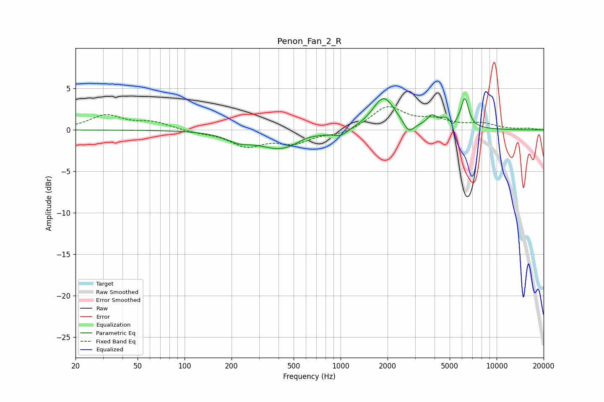

# Penon_Fan_2_R
See [usage instructions](https://github.com/jaakkopasanen/AutoEq#usage) for more options and info.

### Parametric EQs
Apply preamp of -3.9 dB when using parametric equalizer.

|   # | Type    |   Fc (Hz) |    Q |   Gain (dB) |
|-----|---------|-----------|------|-------------|
|   1 | Peaking |       222 | 1.8  |        -0.9 |
|   2 | Peaking |       418 | 0.97 |        -2.3 |
|   3 | Peaking |       600 | 2.05 |         0.4 |
|   4 | Peaking |      1001 | 3.16 |        -0.7 |
|   5 | Peaking |      1889 | 1.97 |         4   |
|   6 | Peaking |      2737 | 4.43 |        -1.3 |
|   7 | Peaking |      3831 | 4.91 |         1.1 |
|   8 | Peaking |      4958 | 2.56 |         1.6 |
|   9 | Peaking |      5228 | 6    |        -1.4 |
|  10 | Peaking |      6259 | 5.81 |         3.3 |

### Fixed Band EQs
When using fixed band (also called graphic) equalizer, apply preamp of **-2.9 dB** (if available) and set gains manually with these parameters.

|   # | Type    |   Fc (Hz) |    Q |   Gain (dB) |
|-----|---------|-----------|------|-------------|
|   1 | Peaking |        31 | 1.41 |         1.7 |
|   2 | Peaking |        62 | 1.41 |         0.9 |
|   3 | Peaking |       125 | 1.41 |        -0.3 |
|   4 | Peaking |       250 | 1.41 |        -1.8 |
|   5 | Peaking |       500 | 1.41 |        -1.4 |
|   6 | Peaking |      1000 | 1.41 |        -0.6 |
|   7 | Peaking |      2000 | 1.41 |         2.8 |
|   8 | Peaking |      4000 | 1.41 |         1   |
|   9 | Peaking |      8000 | 1.41 |         0.7 |
|  10 | Peaking |     16000 | 1.41 |         0.2 |

### Graphs

