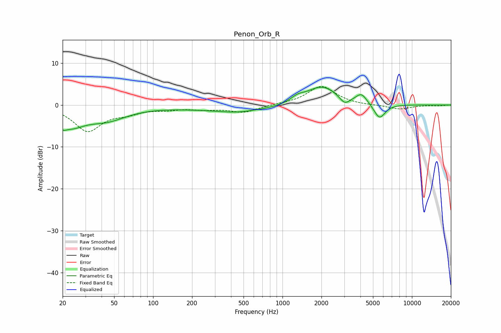

# Penon_Orb_R
See [usage instructions](https://github.com/jaakkopasanen/AutoEq#usage) for more options and info.

### Parametric EQs
Apply preamp of -4.3 dB when using parametric equalizer.

|   # | Type    |   Fc (Hz) |    Q |   Gain (dB) |
|-----|---------|-----------|------|-------------|
|   1 | Peaking |        20 | 5.26 |        -1.5 |
|   2 | Peaking |        23 | 1.37 |        -4   |
|   3 | Peaking |        43 | 0.86 |        -3.2 |
|   4 | Peaking |       442 | 1.11 |        -0.6 |
|   5 | Peaking |       498 | 0.29 |        -1.3 |
|   6 | Peaking |      1303 | 2.63 |         1.2 |
|   7 | Peaking |      2014 | 1.1  |         4.8 |
|   8 | Peaking |      3019 | 3.62 |        -1.9 |
|   9 | Peaking |      4075 | 3.27 |         2.3 |
|  10 | Peaking |      5616 | 3.15 |        -3.6 |

### Fixed Band EQs
When using fixed band (also called graphic) equalizer, apply preamp of **-4.5 dB** (if available) and set gains manually with these parameters.

|   # | Type    |   Fc (Hz) |    Q |   Gain (dB) |
|-----|---------|-----------|------|-------------|
|   1 | Peaking |        31 | 1.41 |        -6.1 |
|   2 | Peaking |        62 | 1.41 |        -1.5 |
|   3 | Peaking |       125 | 1.41 |        -0.8 |
|   4 | Peaking |       250 | 1.41 |        -0.8 |
|   5 | Peaking |       500 | 1.41 |        -1.7 |
|   6 | Peaking |      1000 | 1.41 |         0.1 |
|   7 | Peaking |      2000 | 1.41 |         4.5 |
|   8 | Peaking |      4000 | 1.41 |        -0.1 |
|   9 | Peaking |      8000 | 1.41 |        -1   |
|  10 | Peaking |     16000 | 1.41 |        -0.2 |

### Graphs

