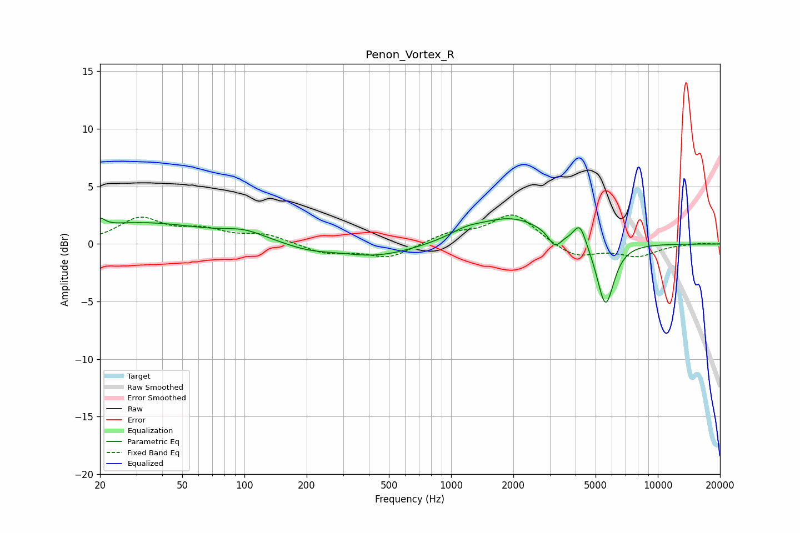

# Penon_Vortex_R
See [usage instructions](https://github.com/jaakkopasanen/AutoEq#usage) for more options and info.

### Parametric EQs
Apply preamp of -2.3 dB when using parametric equalizer.

|   # | Type    |   Fc (Hz) |    Q |   Gain (dB) |
|-----|---------|-----------|------|-------------|
|   1 | Peaking |        20 | 5.99 |         0.7 |
|   2 | Peaking |        31 | 0.45 |         1.8 |
|   3 | Peaking |       100 | 1.41 |         0.7 |
|   4 | Peaking |       203 | 1.35 |        -0.4 |
|   5 | Peaking |       433 | 0.74 |        -1.1 |
|   6 | Peaking |      1178 | 1.82 |         0.6 |
|   7 | Peaking |      1959 | 0.83 |         2.3 |
|   8 | Peaking |      3178 | 4.61 |        -1.3 |
|   9 | Peaking |      4199 | 4.71 |         1.9 |
|  10 | Peaking |      5584 | 3.34 |        -5.6 |

### Fixed Band EQs
When using fixed band (also called graphic) equalizer, apply preamp of **-2.6 dB** (if available) and set gains manually with these parameters.

|   # | Type    |   Fc (Hz) |    Q |   Gain (dB) |
|-----|---------|-----------|------|-------------|
|   1 | Peaking |        31 | 1.41 |         2.1 |
|   2 | Peaking |        62 | 1.41 |         1   |
|   3 | Peaking |       125 | 1.41 |         0.8 |
|   4 | Peaking |       250 | 1.41 |        -0.8 |
|   5 | Peaking |       500 | 1.41 |        -1.2 |
|   6 | Peaking |      1000 | 1.41 |         0.9 |
|   7 | Peaking |      2000 | 1.41 |         2.6 |
|   8 | Peaking |      4000 | 1.41 |        -1.2 |
|   9 | Peaking |      8000 | 1.41 |        -1   |
|  10 | Peaking |     16000 | 1.41 |         0.1 |

### Graphs

