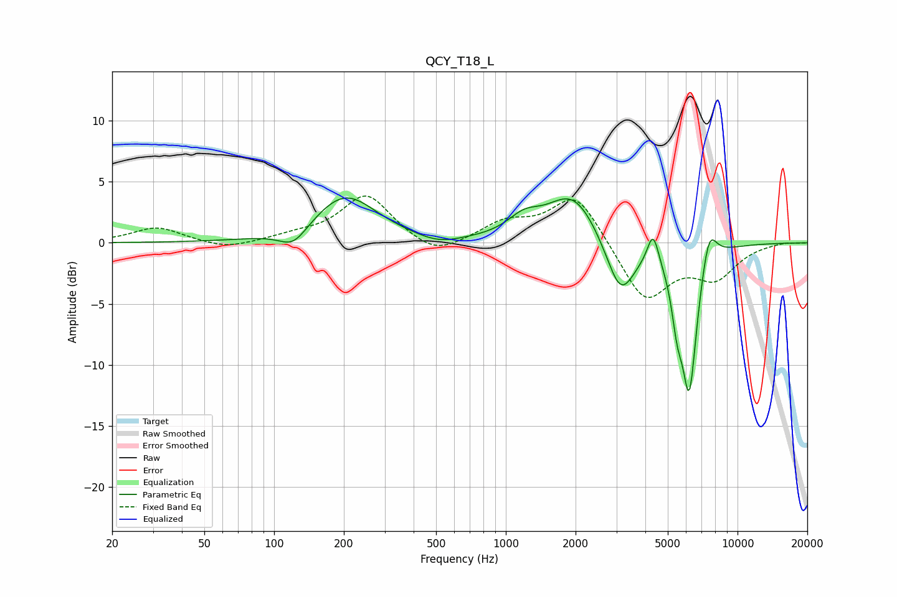

# QCY_T18_L
See [usage instructions](https://github.com/jaakkopasanen/AutoEq#usage) for more options and info.

### Parametric EQs
Apply preamp of -3.8 dB when using parametric equalizer.

|   # | Type    |   Fc (Hz) |    Q |   Gain (dB) |
|-----|---------|-----------|------|-------------|
|   1 | Peaking |       121 | 2.28 |        -1.6 |
|   2 | Peaking |       203 | 1.04 |         3.9 |
|   3 | Peaking |       514 | 1.57 |        -0.6 |
|   4 | Peaking |      1199 | 1.99 |         1.4 |
|   5 | Peaking |      1952 | 1.27 |         4.1 |
|   6 | Peaking |      3126 | 2.22 |        -4.8 |
|   7 | Peaking |      4320 | 5.75 |         2.6 |
|   8 | Peaking |      5487 | 5.92 |        -3.1 |
|   9 | Peaking |      6190 | 3.89 |       -12   |
|  10 | Peaking |      7524 | 4.01 |         3.2 |

### Fixed Band EQs
When using fixed band (also called graphic) equalizer, apply preamp of **-3.9 dB** (if available) and set gains manually with these parameters.

|   # | Type    |   Fc (Hz) |    Q |   Gain (dB) |
|-----|---------|-----------|------|-------------|
|   1 | Peaking |        31 | 1.41 |         1.3 |
|   2 | Peaking |        62 | 1.41 |        -0.6 |
|   3 | Peaking |       125 | 1.41 |         0.5 |
|   4 | Peaking |       250 | 1.41 |         3.9 |
|   5 | Peaking |       500 | 1.41 |        -1.3 |
|   6 | Peaking |      1000 | 1.41 |         1.5 |
|   7 | Peaking |      2000 | 1.41 |         4.1 |
|   8 | Peaking |      4000 | 1.41 |        -4.8 |
|   9 | Peaking |      8000 | 1.41 |        -2.6 |
|  10 | Peaking |     16000 | 1.41 |         0.1 |

### Graphs

