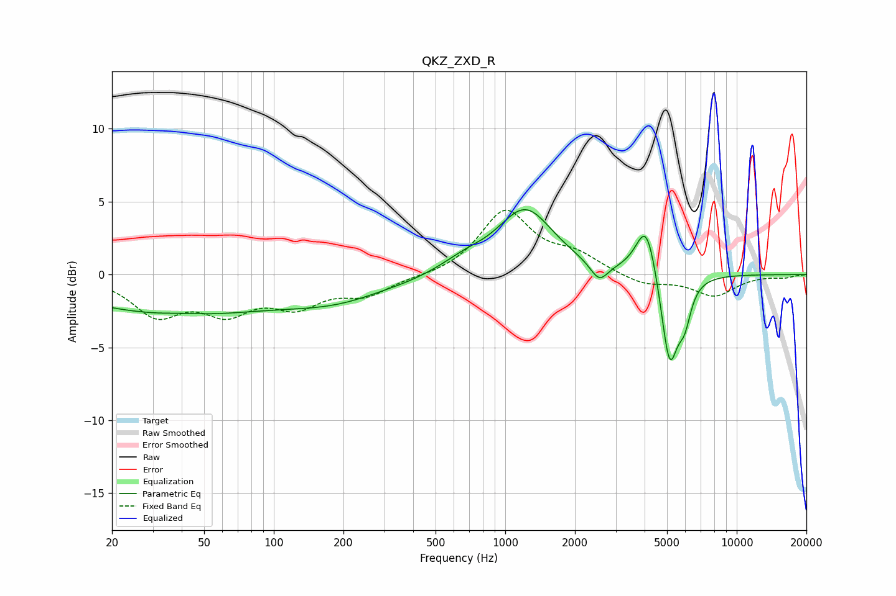

# QKZ_ZXD_R
See [usage instructions](https://github.com/jaakkopasanen/AutoEq#usage) for more options and info.

### Parametric EQs
Apply preamp of -4.5 dB when using parametric equalizer.

|   # | Type    |   Fc (Hz) |    Q |   Gain (dB) |
|-----|---------|-----------|------|-------------|
|   1 | Peaking |        37 | 0.32 |        -2.6 |
|   2 | Peaking |        40 | 1.81 |         0.1 |
|   3 | Peaking |       189 | 0.63 |        -1.4 |
|   4 | Peaking |       378 | 1.82 |        -0.1 |
|   5 | Peaking |       664 | 1.47 |         0.7 |
|   6 | Peaking |      1220 | 1.18 |         4.4 |
|   7 | Peaking |      2546 | 3.65 |        -1.3 |
|   8 | Peaking |      4072 | 3.12 |         3.8 |
|   9 | Peaking |      5127 | 3.8  |        -6.5 |
|  10 | Peaking |      5953 | 4.95 |        -2.2 |

### Fixed Band EQs
When using fixed band (also called graphic) equalizer, apply preamp of **-4.5 dB** (if available) and set gains manually with these parameters.

|   # | Type    |   Fc (Hz) |    Q |   Gain (dB) |
|-----|---------|-----------|------|-------------|
|   1 | Peaking |        31 | 1.41 |        -2.6 |
|   2 | Peaking |        62 | 1.41 |        -2.2 |
|   3 | Peaking |       125 | 1.41 |        -1.9 |
|   4 | Peaking |       250 | 1.41 |        -1.3 |
|   5 | Peaking |       500 | 1.41 |        -0.1 |
|   6 | Peaking |      1000 | 1.41 |         4.3 |
|   7 | Peaking |      2000 | 1.41 |         1.2 |
|   8 | Peaking |      4000 | 1.41 |        -0.7 |
|   9 | Peaking |      8000 | 1.41 |        -1.4 |
|  10 | Peaking |     16000 | 1.41 |        -0.2 |

### Graphs

