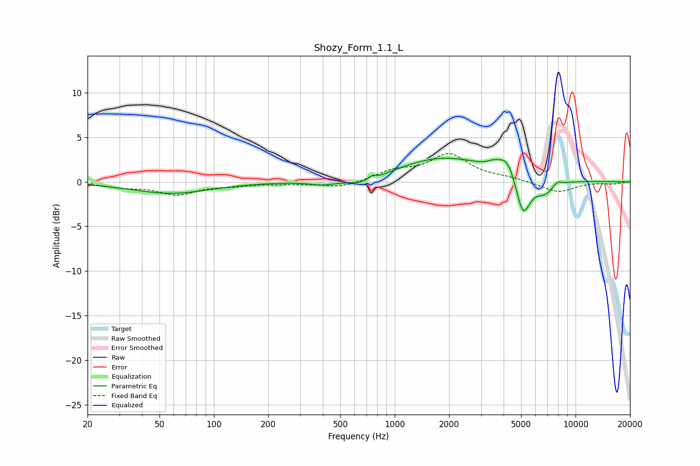

# Shozy_Form_1.1_L
See [usage instructions](https://github.com/jaakkopasanen/AutoEq#usage) for more options and info.

### Parametric EQs
Apply preamp of -2.7 dB when using parametric equalizer.

|   # | Type    |   Fc (Hz) |    Q |   Gain (dB) |
|-----|---------|-----------|------|-------------|
|   1 | Peaking |        58 | 0.65 |        -1.3 |
|   2 | Peaking |       397 | 2.04 |        -0.4 |
|   3 | Peaking |       692 | 1.45 |        -1   |
|   4 | Peaking |       747 | 6    |         0.5 |
|   5 | Peaking |      1854 | 0.55 |         2.7 |
|   6 | Peaking |      3501 | 4.46 |         0.4 |
|   7 | Peaking |      4189 | 2.94 |         2.2 |
|   8 | Peaking |      5117 | 3.46 |        -4.5 |
|   9 | Peaking |      6756 | 2.47 |        -1.5 |
|  10 | Peaking |      7908 | 5.31 |         0.5 |

### Fixed Band EQs
When using fixed band (also called graphic) equalizer, apply preamp of **-3.3 dB** (if available) and set gains manually with these parameters.

|   # | Type    |   Fc (Hz) |    Q |   Gain (dB) |
|-----|---------|-----------|------|-------------|
|   1 | Peaking |        31 | 1.41 |        -0.5 |
|   2 | Peaking |        62 | 1.41 |        -1.3 |
|   3 | Peaking |       125 | 1.41 |        -0.3 |
|   4 | Peaking |       250 | 1.41 |        -0.2 |
|   5 | Peaking |       500 | 1.41 |        -0.7 |
|   6 | Peaking |      1000 | 1.41 |         1.1 |
|   7 | Peaking |      2000 | 1.41 |         3   |
|   8 | Peaking |      4000 | 1.41 |         0.4 |
|   9 | Peaking |      8000 | 1.41 |        -1.2 |
|  10 | Peaking |     16000 | 1.41 |        -0.2 |

### Graphs

