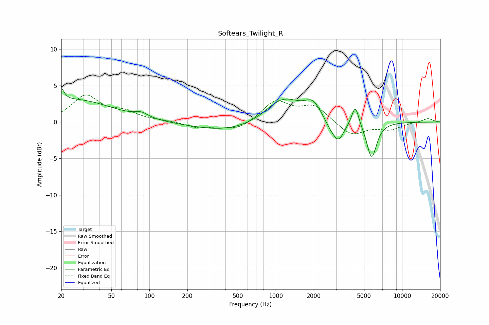

# Softears_Twilight_R
See [usage instructions](https://github.com/jaakkopasanen/AutoEq#usage) for more options and info.

### Parametric EQs
Apply preamp of -4.7 dB when using parametric equalizer.

|   # | Type    |   Fc (Hz) |    Q |   Gain (dB) |
|-----|---------|-----------|------|-------------|
|   1 | Peaking |        20 | 5.94 |         1.8 |
|   2 | Peaking |        26 | 0.49 |         3   |
|   3 | Peaking |        86 | 2.86 |         0.6 |
|   4 | Peaking |       433 | 0.49 |        -1.4 |
|   5 | Peaking |      1143 | 1.01 |         3.5 |
|   6 | Peaking |      1974 | 2.15 |         2.2 |
|   7 | Peaking |      2727 | 2.63 |        -1.1 |
|   8 | Peaking |      3142 | 3.15 |        -2.5 |
|   9 | Peaking |      4264 | 4.97 |         2.8 |
|  10 | Peaking |      5744 | 3.49 |        -5   |

### Fixed Band EQs
When using fixed band (also called graphic) equalizer, apply preamp of **-3.8 dB** (if available) and set gains manually with these parameters.

|   # | Type    |   Fc (Hz) |    Q |   Gain (dB) |
|-----|---------|-----------|------|-------------|
|   1 | Peaking |        31 | 1.41 |         3.5 |
|   2 | Peaking |        62 | 1.41 |         1.2 |
|   3 | Peaking |       125 | 1.41 |         0.1 |
|   4 | Peaking |       250 | 1.41 |        -0.8 |
|   5 | Peaking |       500 | 1.41 |        -1.1 |
|   6 | Peaking |      1000 | 1.41 |         2.8 |
|   7 | Peaking |      2000 | 1.41 |         2.1 |
|   8 | Peaking |      4000 | 1.41 |        -1.9 |
|   9 | Peaking |      8000 | 1.41 |        -0.9 |
|  10 | Peaking |     16000 | 1.41 |         0.5 |

### Graphs

