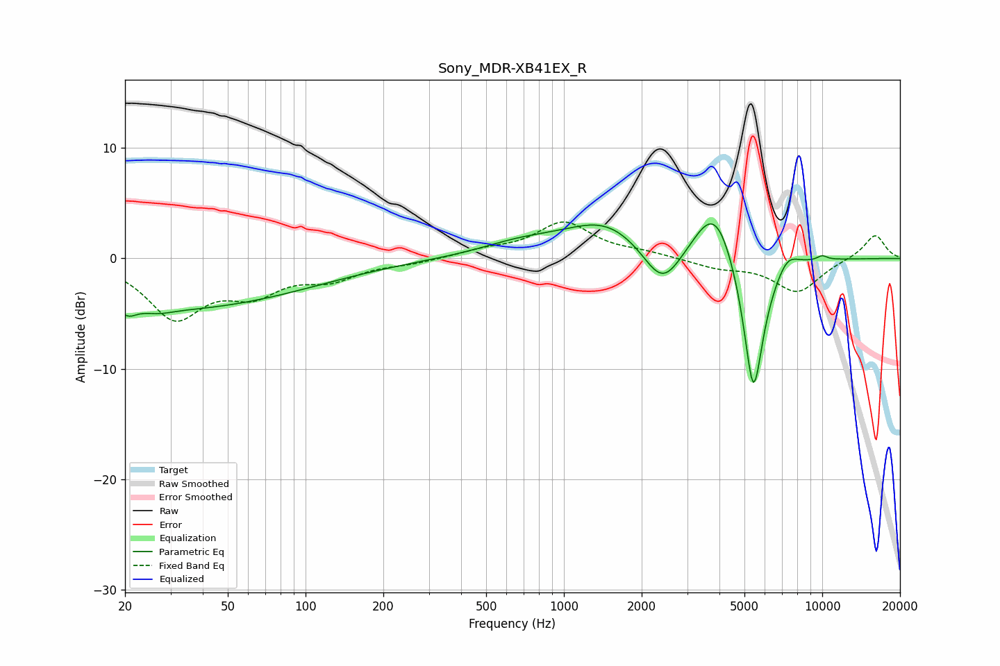

# Sony_MDR-XB41EX_R
See [usage instructions](https://github.com/jaakkopasanen/AutoEq#usage) for more options and info.

### Parametric EQs
Apply preamp of -3.2 dB when using parametric equalizer.

|   # | Type    |   Fc (Hz) |    Q |   Gain (dB) |
|-----|---------|-----------|------|-------------|
|   1 | Peaking |        21 | 5.16 |        -0.6 |
|   2 | Peaking |        27 | 2.72 |        -0.3 |
|   3 | Peaking |        28 | 0.24 |        -4.6 |
|   4 | Peaking |       683 | 0.87 |         1.1 |
|   5 | Peaking |      1455 | 0.89 |         3.2 |
|   6 | Peaking |      2411 | 1.83 |        -4.1 |
|   7 | Peaking |      3850 | 1.7  |         5.6 |
|   8 | Peaking |      5415 | 3.28 |       -13.6 |
|   9 | Peaking |      7335 | 3.1  |         1.5 |
|  10 | Peaking |     10000 | 6    |         0.4 |

### Fixed Band EQs
When using fixed band (also called graphic) equalizer, apply preamp of **-3.4 dB** (if available) and set gains manually with these parameters.

|   # | Type    |   Fc (Hz) |    Q |   Gain (dB) |
|-----|---------|-----------|------|-------------|
|   1 | Peaking |        31 | 1.41 |        -5.1 |
|   2 | Peaking |        62 | 1.41 |        -2.7 |
|   3 | Peaking |       125 | 1.41 |        -1.6 |
|   4 | Peaking |       250 | 1.41 |        -0.4 |
|   5 | Peaking |       500 | 1.41 |         0.6 |
|   6 | Peaking |      1000 | 1.41 |         3.2 |
|   7 | Peaking |      2000 | 1.41 |         0.4 |
|   8 | Peaking |      4000 | 1.41 |        -0.8 |
|   9 | Peaking |      8000 | 1.41 |        -3   |
|  10 | Peaking |     16000 | 1.41 |         2.2 |

### Graphs

