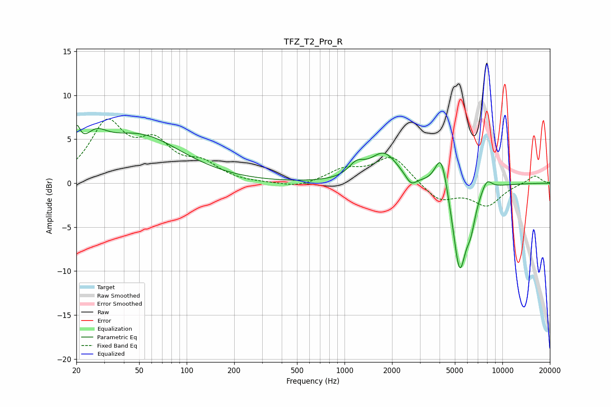

# TFZ_T2_Pro_R
See [usage instructions](https://github.com/jaakkopasanen/AutoEq#usage) for more options and info.

### Parametric EQs
Apply preamp of -6.7 dB when using parametric equalizer.

|   # | Type    |   Fc (Hz) |    Q |   Gain (dB) |
|-----|---------|-----------|------|-------------|
|   1 | Peaking |        20 | 6    |         3   |
|   2 | Peaking |        26 | 1.94 |         2.4 |
|   3 | Peaking |        49 | 0.52 |         5.3 |
|   4 | Peaking |      1191 | 2.8  |         1.4 |
|   5 | Peaking |      1780 | 1.61 |         3.3 |
|   6 | Peaking |      2638 | 4.19 |        -1.1 |
|   7 | Peaking |      4100 | 3.54 |         4.5 |
|   8 | Peaking |      5355 | 3.14 |       -10.1 |
|   9 | Peaking |      6313 | 4.74 |        -2.5 |
|  10 | Peaking |      7963 | 4.04 |         1.4 |

### Fixed Band EQs
When using fixed band (also called graphic) equalizer, apply preamp of **-7.4 dB** (if available) and set gains manually with these parameters.

|   # | Type    |   Fc (Hz) |    Q |   Gain (dB) |
|-----|---------|-----------|------|-------------|
|   1 | Peaking |        31 | 1.41 |         6.5 |
|   2 | Peaking |        62 | 1.41 |         3.9 |
|   3 | Peaking |       125 | 1.41 |         1.9 |
|   4 | Peaking |       250 | 1.41 |        -0.1 |
|   5 | Peaking |       500 | 1.41 |        -0.6 |
|   6 | Peaking |      1000 | 1.41 |         1.4 |
|   7 | Peaking |      2000 | 1.41 |         3.1 |
|   8 | Peaking |      4000 | 1.41 |        -2   |
|   9 | Peaking |      8000 | 1.41 |        -2.4 |
|  10 | Peaking |     16000 | 1.41 |         0.9 |

### Graphs

