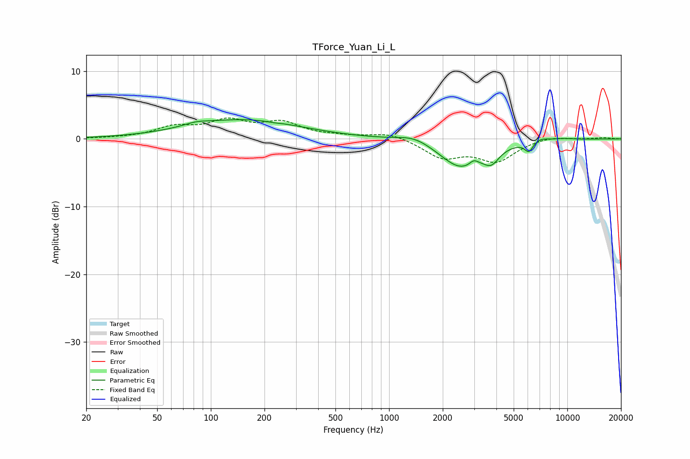

# TForce_Yuan_Li_L
See [usage instructions](https://github.com/jaakkopasanen/AutoEq#usage) for more options and info.

### Parametric EQs
Apply preamp of -2.9 dB when using parametric equalizer.

|   # | Type    |   Fc (Hz) |    Q |   Gain (dB) |
|-----|---------|-----------|------|-------------|
|   1 | Peaking |        83 | 2.16 |         0.4 |
|   2 | Peaking |       153 | 0.45 |         2.8 |
|   3 | Peaking |       225 | 4.69 |        -0.1 |
|   4 | Peaking |      1383 | 1.53 |         1   |
|   5 | Peaking |      2528 | 1.2  |        -4.2 |
|   6 | Peaking |      2983 | 6    |         0.8 |
|   7 | Peaking |      3749 | 3.25 |        -2   |
|   8 | Peaking |      6083 | 6    |        -1.4 |
|   9 | Peaking |      7110 | 3.16 |         0.5 |
|  10 | Peaking |      9474 | 2.24 |         0.2 |

### Fixed Band EQs
When using fixed band (also called graphic) equalizer, apply preamp of **-3.2 dB** (if available) and set gains manually with these parameters.

|   # | Type    |   Fc (Hz) |    Q |   Gain (dB) |
|-----|---------|-----------|------|-------------|
|   1 | Peaking |        31 | 1.41 |         0.1 |
|   2 | Peaking |        62 | 1.41 |         1.6 |
|   3 | Peaking |       125 | 1.41 |         2.4 |
|   4 | Peaking |       250 | 1.41 |         2.2 |
|   5 | Peaking |       500 | 1.41 |         0.3 |
|   6 | Peaking |      1000 | 1.41 |         0.9 |
|   7 | Peaking |      2000 | 1.41 |        -2.6 |
|   8 | Peaking |      4000 | 1.41 |        -3.1 |
|   9 | Peaking |      8000 | 1.41 |         0.5 |
|  10 | Peaking |     16000 | 1.41 |         0.2 |

### Graphs

