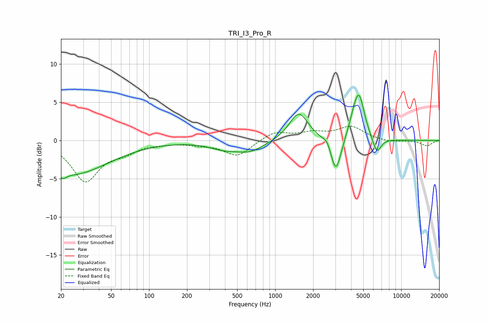

# TRI_I3_Pro_R
See [usage instructions](https://github.com/jaakkopasanen/AutoEq#usage) for more options and info.

### Parametric EQs
Apply preamp of -6.0 dB when using parametric equalizer.

|   # | Type    |   Fc (Hz) |    Q |   Gain (dB) |
|-----|---------|-----------|------|-------------|
|   1 | Peaking |        21 | 5.71 |        -0.7 |
|   2 | Peaking |        24 | 0.48 |        -4.4 |
|   3 | Peaking |       387 | 1.26 |        -0.8 |
|   4 | Peaking |       631 | 1.22 |        -1.3 |
|   5 | Peaking |      1539 | 1.89 |         3.7 |
|   6 | Peaking |      2580 | 5.58 |         0.7 |
|   7 | Peaking |      3037 | 3.38 |        -4.7 |
|   8 | Peaking |      4208 | 3.2  |         1.8 |
|   9 | Peaking |      4642 | 3.31 |         5.2 |
|  10 | Peaking |      6403 | 4.13 |        -2.1 |

### Fixed Band EQs
When using fixed band (also called graphic) equalizer, apply preamp of **-2.0 dB** (if available) and set gains manually with these parameters.

|   # | Type    |   Fc (Hz) |    Q |   Gain (dB) |
|-----|---------|-----------|------|-------------|
|   1 | Peaking |        31 | 1.41 |        -5.2 |
|   2 | Peaking |        62 | 1.41 |        -1.2 |
|   3 | Peaking |       125 | 1.41 |        -0.2 |
|   4 | Peaking |       250 | 1.41 |        -0.4 |
|   5 | Peaking |       500 | 1.41 |        -2   |
|   6 | Peaking |      1000 | 1.41 |         1.2 |
|   7 | Peaking |      2000 | 1.41 |         0.8 |
|   8 | Peaking |      4000 | 1.41 |         1.7 |
|   9 | Peaking |      8000 | 1.41 |        -0.3 |
|  10 | Peaking |     16000 | 1.41 |        -0.7 |

### Graphs

