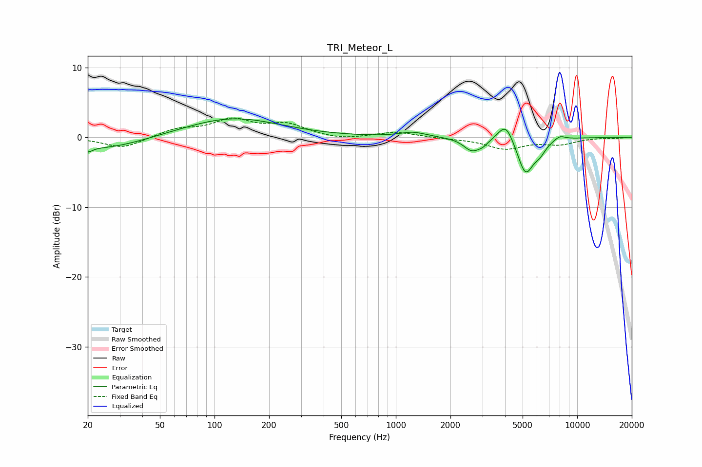

# TRI_Meteor_L
See [usage instructions](https://github.com/jaakkopasanen/AutoEq#usage) for more options and info.

### Parametric EQs
Apply preamp of -2.7 dB when using parametric equalizer.

|   # | Type    |   Fc (Hz) |    Q |   Gain (dB) |
|-----|---------|-----------|------|-------------|
|   1 | Peaking |        20 | 5.68 |        -0.7 |
|   2 | Peaking |        25 | 0.65 |        -1.7 |
|   3 | Peaking |       125 | 0.54 |         2.8 |
|   4 | Peaking |      1243 | 1.99 |         0.7 |
|   5 | Peaking |      2621 | 3.08 |        -1.8 |
|   6 | Peaking |      3021 | 4.56 |        -0.7 |
|   7 | Peaking |      4038 | 3.33 |         2.7 |
|   8 | Peaking |      5183 | 3.15 |        -5.2 |
|   9 | Peaking |      6221 | 3.99 |        -1.3 |
|  10 | Peaking |      8019 | 4.25 |         0.6 |

### Fixed Band EQs
When using fixed band (also called graphic) equalizer, apply preamp of **-2.9 dB** (if available) and set gains manually with these parameters.

|   # | Type    |   Fc (Hz) |    Q |   Gain (dB) |
|-----|---------|-----------|------|-------------|
|   1 | Peaking |        31 | 1.41 |        -1.6 |
|   2 | Peaking |        62 | 1.41 |         1.1 |
|   3 | Peaking |       125 | 1.41 |         2.3 |
|   4 | Peaking |       250 | 1.41 |         1.7 |
|   5 | Peaking |       500 | 1.41 |        -0.4 |
|   6 | Peaking |      1000 | 1.41 |         0.8 |
|   7 | Peaking |      2000 | 1.41 |        -0.1 |
|   8 | Peaking |      4000 | 1.41 |        -1.6 |
|   9 | Peaking |      8000 | 1.41 |        -0.9 |
|  10 | Peaking |     16000 | 1.41 |        -0.1 |

### Graphs

