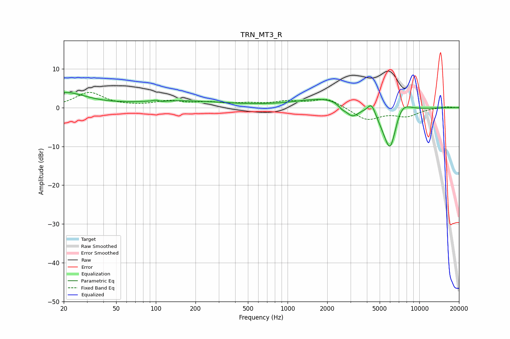

# TRN_MT3_R
See [usage instructions](https://github.com/jaakkopasanen/AutoEq#usage) for more options and info.

### Parametric EQs
Apply preamp of -4.0 dB when using parametric equalizer.

|   # | Type    |   Fc (Hz) |    Q |   Gain (dB) |
|-----|---------|-----------|------|-------------|
|   1 | Peaking |        20 | 0.88 |         3.7 |
|   2 | Peaking |       103 | 4.86 |         1.5 |
|   3 | Peaking |       104 | 4.4  |        -1.4 |
|   4 | Peaking |       154 | 0.39 |         1.6 |
|   5 | Peaking |      2132 | 0.61 |         2.7 |
|   6 | Peaking |      2590 | 5.23 |        -0.9 |
|   7 | Peaking |      3085 | 2.83 |        -3.2 |
|   8 | Peaking |      4343 | 4.57 |         3.2 |
|   9 | Peaking |      6008 | 2.15 |       -14.2 |
|  10 | Peaking |      7204 | 1.86 |         5.6 |

### Fixed Band EQs
When using fixed band (also called graphic) equalizer, apply preamp of **-4.0 dB** (if available) and set gains manually with these parameters.

|   # | Type    |   Fc (Hz) |    Q |   Gain (dB) |
|-----|---------|-----------|------|-------------|
|   1 | Peaking |        31 | 1.41 |         3.8 |
|   2 | Peaking |        62 | 1.41 |         0.2 |
|   3 | Peaking |       125 | 1.41 |         1.5 |
|   4 | Peaking |       250 | 1.41 |         1.1 |
|   5 | Peaking |       500 | 1.41 |         0.8 |
|   6 | Peaking |      1000 | 1.41 |         1.3 |
|   7 | Peaking |      2000 | 1.41 |         2.3 |
|   8 | Peaking |      4000 | 1.41 |        -3.2 |
|   9 | Peaking |      8000 | 1.41 |        -2   |
|  10 | Peaking |     16000 | 1.41 |         0.3 |

### Graphs

