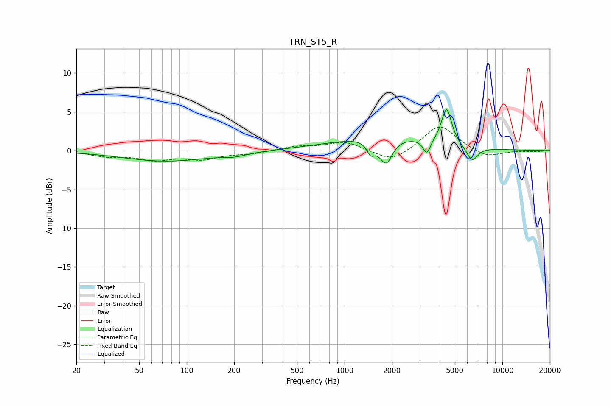

# TRN_ST5_R
See [usage instructions](https://github.com/jaakkopasanen/AutoEq#usage) for more options and info.

### Parametric EQs
Apply preamp of -5.4 dB when using parametric equalizer.

|   # | Type    |   Fc (Hz) |    Q |   Gain (dB) |
|-----|---------|-----------|------|-------------|
|   1 | Peaking |        74 | 0.51 |        -1.4 |
|   2 | Peaking |       201 | 1.94 |        -0.4 |
|   3 | Peaking |      1464 | 5.8  |        -1.5 |
|   4 | Peaking |      1647 | 3.48 |        -0.4 |
|   5 | Peaking |      1794 | 0.44 |         1.9 |
|   6 | Peaking |      1842 | 3.64 |        -3   |
|   7 | Peaking |      3324 | 6    |        -1.9 |
|   8 | Peaking |      4421 | 4.47 |         4.3 |
|   9 | Peaking |      4536 | 4.5  |         0.5 |
|  10 | Peaking |      6429 | 3.82 |        -2   |

### Fixed Band EQs
When using fixed band (also called graphic) equalizer, apply preamp of **-3.1 dB** (if available) and set gains manually with these parameters.

|   # | Type    |   Fc (Hz) |    Q |   Gain (dB) |
|-----|---------|-----------|------|-------------|
|   1 | Peaking |        31 | 1.41 |        -0.6 |
|   2 | Peaking |        62 | 1.41 |        -1.1 |
|   3 | Peaking |       125 | 1.41 |        -1   |
|   4 | Peaking |       250 | 1.41 |        -0.4 |
|   5 | Peaking |       500 | 1.41 |         0.5 |
|   6 | Peaking |      1000 | 1.41 |         1.1 |
|   7 | Peaking |      2000 | 1.41 |        -1.6 |
|   8 | Peaking |      4000 | 1.41 |         3.4 |
|   9 | Peaking |      8000 | 1.41 |        -1   |
|  10 | Peaking |     16000 | 1.41 |        -0.1 |

### Graphs

