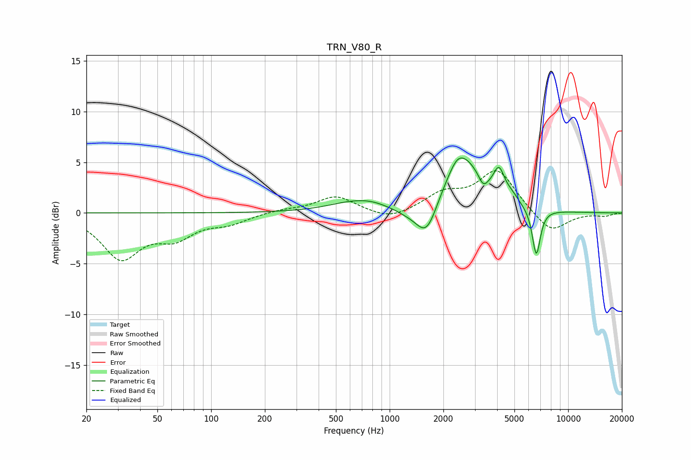

# TRN_V80_R
See [usage instructions](https://github.com/jaakkopasanen/AutoEq#usage) for more options and info.

### Parametric EQs
Apply preamp of -5.5 dB when using parametric equalizer.

|   # | Type    |   Fc (Hz) |    Q |   Gain (dB) |
|-----|---------|-----------|------|-------------|
|   1 | Peaking |       646 | 0.97 |         1   |
|   2 | Peaking |       801 | 1.98 |         0.2 |
|   3 | Peaking |      1245 | 1.88 |        -0.5 |
|   4 | Peaking |      1612 | 2.27 |        -3.6 |
|   5 | Peaking |      2388 | 3.77 |         0.6 |
|   6 | Peaking |      2544 | 1.26 |         5.5 |
|   7 | Peaking |      3344 | 5.54 |        -1.1 |
|   8 | Peaking |      4099 | 4.64 |         2.5 |
|   9 | Peaking |      4831 | 3.47 |         0.7 |
|  10 | Peaking |      6630 | 5.97 |        -4.7 |

### Fixed Band EQs
When using fixed band (also called graphic) equalizer, apply preamp of **-4.2 dB** (if available) and set gains manually with these parameters.

|   # | Type    |   Fc (Hz) |    Q |   Gain (dB) |
|-----|---------|-----------|------|-------------|
|   1 | Peaking |        31 | 1.41 |        -4.3 |
|   2 | Peaking |        62 | 1.41 |        -2.1 |
|   3 | Peaking |       125 | 1.41 |        -0.9 |
|   4 | Peaking |       250 | 1.41 |         0.3 |
|   5 | Peaking |       500 | 1.41 |         1.6 |
|   6 | Peaking |      1000 | 1.41 |        -0.8 |
|   7 | Peaking |      2000 | 1.41 |         1.7 |
|   8 | Peaking |      4000 | 1.41 |         4.2 |
|   9 | Peaking |      8000 | 1.41 |        -2.1 |
|  10 | Peaking |     16000 | 1.41 |        -0.3 |

### Graphs

