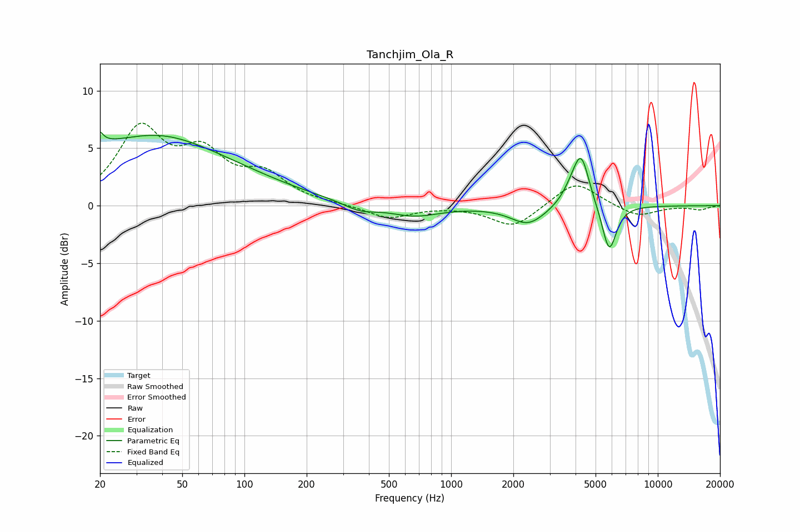

# Tanchjim_Ola_R
See [usage instructions](https://github.com/jaakkopasanen/AutoEq#usage) for more options and info.

### Parametric EQs
Apply preamp of -6.5 dB when using parametric equalizer.

|   # | Type    |   Fc (Hz) |    Q |   Gain (dB) |
|-----|---------|-----------|------|-------------|
|   1 | Peaking |        20 | 6    |         5   |
|   2 | Peaking |        20 | 5.99 |        -3.8 |
|   3 | Peaking |        31 | 0.26 |         5.1 |
|   4 | Peaking |        40 | 0.72 |         1.1 |
|   5 | Peaking |       361 | 1.81 |        -0.7 |
|   6 | Peaking |       664 | 1.13 |        -0.9 |
|   7 | Peaking |      2362 | 1.67 |        -1.6 |
|   8 | Peaking |      3870 | 2.83 |         1.2 |
|   9 | Peaking |      4267 | 3.62 |         4   |
|  10 | Peaking |      5820 | 3.99 |        -4.2 |

### Fixed Band EQs
When using fixed band (also called graphic) equalizer, apply preamp of **-7.3 dB** (if available) and set gains manually with these parameters.

|   # | Type    |   Fc (Hz) |    Q |   Gain (dB) |
|-----|---------|-----------|------|-------------|
|   1 | Peaking |        31 | 1.41 |         6.3 |
|   2 | Peaking |        62 | 1.41 |         3.9 |
|   3 | Peaking |       125 | 1.41 |         2.4 |
|   4 | Peaking |       250 | 1.41 |         0.1 |
|   5 | Peaking |       500 | 1.41 |        -1.1 |
|   6 | Peaking |      1000 | 1.41 |        -0   |
|   7 | Peaking |      2000 | 1.41 |        -1.9 |
|   8 | Peaking |      4000 | 1.41 |         2.2 |
|   9 | Peaking |      8000 | 1.41 |        -1   |
|  10 | Peaking |     16000 | 1.41 |        -0.3 |

### Graphs

