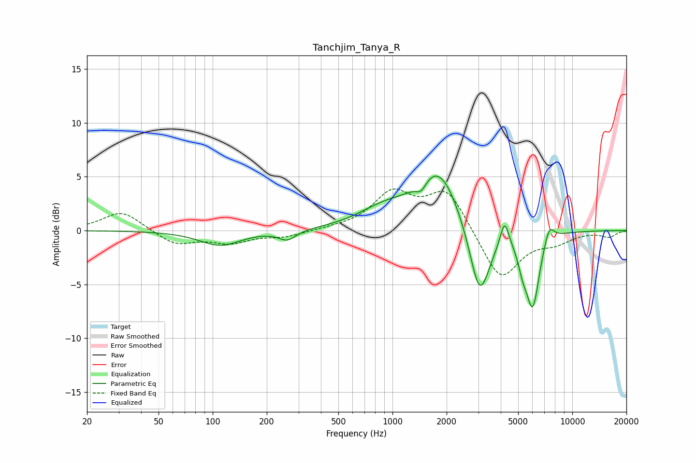

# Tanchjim_Tanya_R
See [usage instructions](https://github.com/jaakkopasanen/AutoEq#usage) for more options and info.

### Parametric EQs
Apply preamp of -5.2 dB when using parametric equalizer.

|   # | Type    |   Fc (Hz) |    Q |   Gain (dB) |
|-----|---------|-----------|------|-------------|
|   1 | Peaking |       110 | 1.24 |        -1.4 |
|   2 | Peaking |       260 | 2.92 |        -0.9 |
|   3 | Peaking |       897 | 0.97 |         1.6 |
|   4 | Peaking |      1444 | 4.97 |        -0.9 |
|   5 | Peaking |      1807 | 1.2  |         5.6 |
|   6 | Peaking |      3055 | 2.43 |        -7.1 |
|   7 | Peaking |      4202 | 6    |         2.4 |
|   8 | Peaking |      5288 | 5.36 |        -1.6 |
|   9 | Peaking |      6024 | 3.68 |        -6.9 |
|  10 | Peaking |      7446 | 4.85 |         1.6 |

### Fixed Band EQs
When using fixed band (also called graphic) equalizer, apply preamp of **-4.0 dB** (if available) and set gains manually with these parameters.

|   # | Type    |   Fc (Hz) |    Q |   Gain (dB) |
|-----|---------|-----------|------|-------------|
|   1 | Peaking |        31 | 1.41 |         1.8 |
|   2 | Peaking |        62 | 1.41 |        -1.3 |
|   3 | Peaking |       125 | 1.41 |        -1   |
|   4 | Peaking |       250 | 1.41 |        -0.5 |
|   5 | Peaking |       500 | 1.41 |         0.1 |
|   6 | Peaking |      1000 | 1.41 |         3.3 |
|   7 | Peaking |      2000 | 1.41 |         3.8 |
|   8 | Peaking |      4000 | 1.41 |        -4.7 |
|   9 | Peaking |      8000 | 1.41 |        -0.9 |
|  10 | Peaking |     16000 | 1.41 |        -0.6 |

### Graphs

