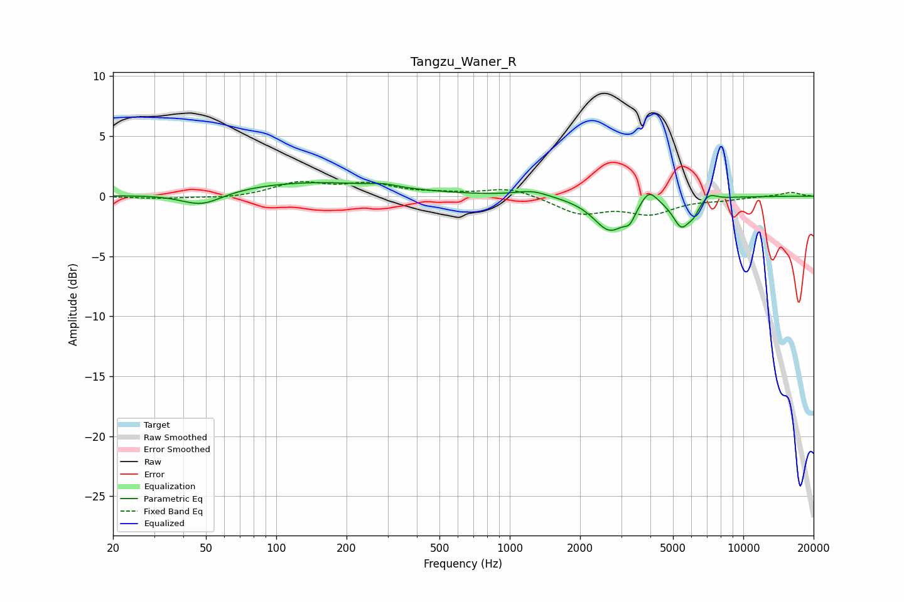

# Tangzu_Waner_R
See [usage instructions](https://github.com/jaakkopasanen/AutoEq#usage) for more options and info.

### Parametric EQs
Apply preamp of -1.2 dB when using parametric equalizer.

|   # | Type    |   Fc (Hz) |    Q |   Gain (dB) |
|-----|---------|-----------|------|-------------|
|   1 | Peaking |        48 | 1.61 |        -1.1 |
|   2 | Peaking |       141 | 0.42 |         1.2 |
|   3 | Peaking |       289 | 2.71 |         0.2 |
|   4 | Peaking |      1246 | 2.01 |         0.5 |
|   5 | Peaking |      2685 | 2.02 |        -2.8 |
|   6 | Peaking |      3264 | 6    |        -0.9 |
|   7 | Peaking |      3941 | 4.05 |         1.3 |
|   8 | Peaking |      5436 | 3.69 |        -2.3 |
|   9 | Peaking |      6131 | 6    |        -0.7 |
|  10 | Peaking |      7158 | 4.56 |         0.6 |

### Fixed Band EQs
When using fixed band (also called graphic) equalizer, apply preamp of **-1.3 dB** (if available) and set gains manually with these parameters.

|   # | Type    |   Fc (Hz) |    Q |   Gain (dB) |
|-----|---------|-----------|------|-------------|
|   1 | Peaking |        31 | 1.41 |        -0.2 |
|   2 | Peaking |        62 | 1.41 |        -0.2 |
|   3 | Peaking |       125 | 1.41 |         1.1 |
|   4 | Peaking |       250 | 1.41 |         0.9 |
|   5 | Peaking |       500 | 1.41 |         0.2 |
|   6 | Peaking |      1000 | 1.41 |         0.7 |
|   7 | Peaking |      2000 | 1.41 |        -1.4 |
|   8 | Peaking |      4000 | 1.41 |        -1.3 |
|   9 | Peaking |      8000 | 1.41 |        -0.2 |
|  10 | Peaking |     16000 | 1.41 |         0.3 |

### Graphs

