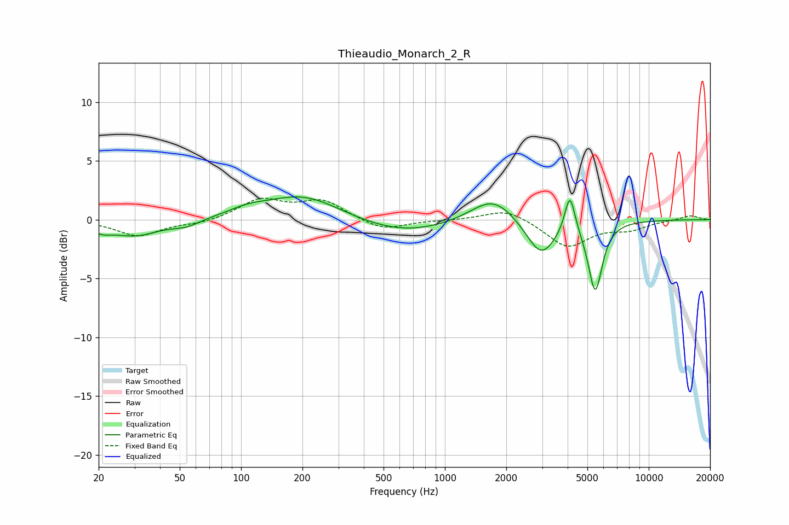

# Thieaudio_Monarch_2_R
See [usage instructions](https://github.com/jaakkopasanen/AutoEq#usage) for more options and info.

### Parametric EQs
Apply preamp of -2.0 dB when using parametric equalizer.

|   # | Type    |   Fc (Hz) |    Q |   Gain (dB) |
|-----|---------|-----------|------|-------------|
|   1 | Peaking |        21 | 3.04 |        -0.5 |
|   2 | Peaking |        30 | 1.15 |        -1.3 |
|   3 | Peaking |        54 | 2.1  |        -0.5 |
|   4 | Peaking |       107 | 1.46 |         0.5 |
|   5 | Peaking |       202 | 0.76 |         2.1 |
|   6 | Peaking |       618 | 0.61 |        -1.3 |
|   7 | Peaking |      1722 | 1.29 |         2.2 |
|   8 | Peaking |      2961 | 1.94 |        -3.2 |
|   9 | Peaking |      4103 | 5.64 |         3.4 |
|  10 | Peaking |      5465 | 4.05 |        -5.9 |

### Fixed Band EQs
When using fixed band (also called graphic) equalizer, apply preamp of **-1.9 dB** (if available) and set gains manually with these parameters.

|   # | Type    |   Fc (Hz) |    Q |   Gain (dB) |
|-----|---------|-----------|------|-------------|
|   1 | Peaking |        31 | 1.41 |        -1.4 |
|   2 | Peaking |        62 | 1.41 |        -0.3 |
|   3 | Peaking |       125 | 1.41 |         1.7 |
|   4 | Peaking |       250 | 1.41 |         1.6 |
|   5 | Peaking |       500 | 1.41 |        -1   |
|   6 | Peaking |      1000 | 1.41 |        -0   |
|   7 | Peaking |      2000 | 1.41 |         1   |
|   8 | Peaking |      4000 | 1.41 |        -2.3 |
|   9 | Peaking |      8000 | 1.41 |        -0.7 |
|  10 | Peaking |     16000 | 1.41 |         0.4 |

### Graphs

