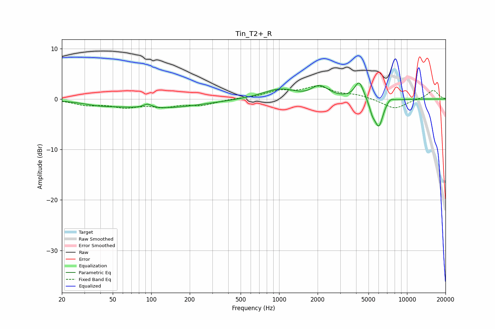

# Tin_T2+_R
See [usage instructions](https://github.com/jaakkopasanen/AutoEq#usage) for more options and info.

### Parametric EQs
Apply preamp of -3.3 dB when using parametric equalizer.

|   # | Type    |   Fc (Hz) |    Q |   Gain (dB) |
|-----|---------|-----------|------|-------------|
|   1 | Peaking |        39 | 1.18 |        -0.5 |
|   2 | Peaking |        93 | 4.4  |         0.8 |
|   3 | Peaking |       111 | 0.41 |        -1.8 |
|   4 | Peaking |      1026 | 1.03 |         2   |
|   5 | Peaking |      1665 | 1.51 |        -0.6 |
|   6 | Peaking |      2059 | 2.05 |         2.5 |
|   7 | Peaking |      4228 | 3.97 |         3.6 |
|   8 | Peaking |      5355 | 5.99 |        -1.8 |
|   9 | Peaking |      6022 | 4.01 |        -5.4 |
|  10 | Peaking |      7364 | 4.61 |         0.8 |

### Fixed Band EQs
When using fixed band (also called graphic) equalizer, apply preamp of **-2.7 dB** (if available) and set gains manually with these parameters.

|   # | Type    |   Fc (Hz) |    Q |   Gain (dB) |
|-----|---------|-----------|------|-------------|
|   1 | Peaking |        31 | 1.41 |        -1   |
|   2 | Peaking |        62 | 1.41 |        -1.4 |
|   3 | Peaking |       125 | 1.41 |        -1.3 |
|   4 | Peaking |       250 | 1.41 |        -1.1 |
|   5 | Peaking |       500 | 1.41 |         0.1 |
|   6 | Peaking |      1000 | 1.41 |         1.4 |
|   7 | Peaking |      2000 | 1.41 |         2.3 |
|   8 | Peaking |      4000 | 1.41 |         0.7 |
|   9 | Peaking |      8000 | 1.41 |        -2   |
|  10 | Peaking |     16000 | 1.41 |         1.8 |

### Graphs

