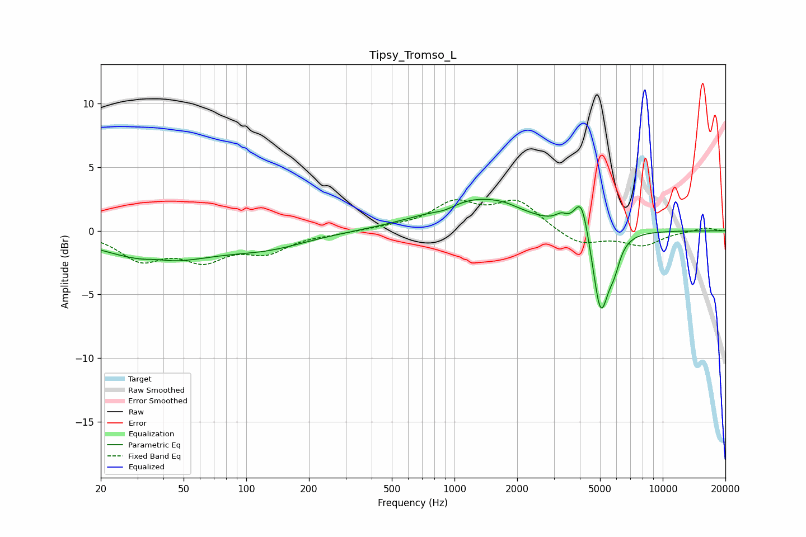

# Tipsy_Tromso_L
See [usage instructions](https://github.com/jaakkopasanen/AutoEq#usage) for more options and info.

### Parametric EQs
Apply preamp of -2.6 dB when using parametric equalizer.

|   # | Type    |   Fc (Hz) |    Q |   Gain (dB) |
|-----|---------|-----------|------|-------------|
|   1 | Peaking |        37 | 2.67 |         0.2 |
|   2 | Peaking |        38 | 0.55 |        -2.3 |
|   3 | Peaking |       128 | 0.72 |        -1   |
|   4 | Peaking |       897 | 2.33 |        -0.4 |
|   5 | Peaking |      1251 | 0.67 |         2.5 |
|   6 | Peaking |      1726 | 2.12 |         0.2 |
|   7 | Peaking |      3253 | 4.94 |         0.6 |
|   8 | Peaking |      4072 | 4.1  |         3   |
|   9 | Peaking |      5035 | 3.63 |        -6.6 |
|  10 | Peaking |      5843 | 4.81 |        -1.6 |

### Fixed Band EQs
When using fixed band (also called graphic) equalizer, apply preamp of **-2.5 dB** (if available) and set gains manually with these parameters.

|   # | Type    |   Fc (Hz) |    Q |   Gain (dB) |
|-----|---------|-----------|------|-------------|
|   1 | Peaking |        31 | 1.41 |        -2.1 |
|   2 | Peaking |        62 | 1.41 |        -2   |
|   3 | Peaking |       125 | 1.41 |        -1.5 |
|   4 | Peaking |       250 | 1.41 |        -0.2 |
|   5 | Peaking |       500 | 1.41 |         0.2 |
|   6 | Peaking |      1000 | 1.41 |         2.1 |
|   7 | Peaking |      2000 | 1.41 |         2.2 |
|   8 | Peaking |      4000 | 1.41 |        -1.2 |
|   9 | Peaking |      8000 | 1.41 |        -1.1 |
|  10 | Peaking |     16000 | 1.41 |         0.3 |

### Graphs

