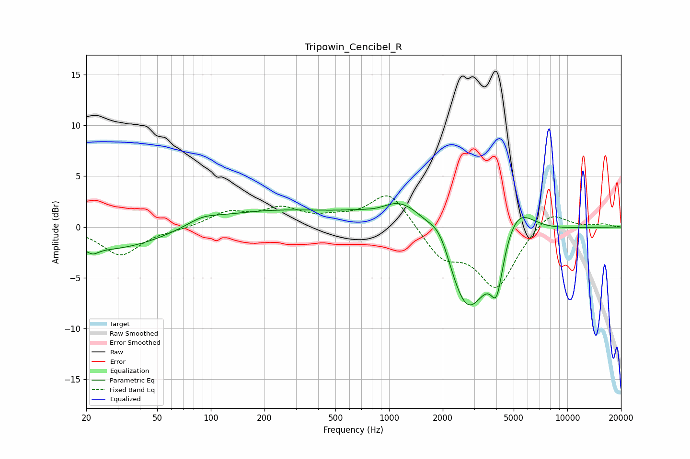

# Tripowin_Cencibel_R
See [usage instructions](https://github.com/jaakkopasanen/AutoEq#usage) for more options and info.

### Parametric EQs
Apply preamp of -2.4 dB when using parametric equalizer.

|   # | Type    |   Fc (Hz) |    Q |   Gain (dB) |
|-----|---------|-----------|------|-------------|
|   1 | Peaking |        22 | 4.56 |        -0.6 |
|   2 | Peaking |        29 | 0.4  |        -2.5 |
|   3 | Peaking |        90 | 1.7  |         0.6 |
|   4 | Peaking |       185 | 0.3  |         1.8 |
|   5 | Peaking |       872 | 1.77 |        -0.6 |
|   6 | Peaking |      1193 | 0.88 |         3.6 |
|   7 | Peaking |      1938 | 2.2  |         2.6 |
|   8 | Peaking |      2737 | 1.09 |        -9.7 |
|   9 | Peaking |      4019 | 4.21 |        -4.3 |
|  10 | Peaking |      5185 | 1.5  |         3.7 |

### Fixed Band EQs
When using fixed band (also called graphic) equalizer, apply preamp of **-3.2 dB** (if available) and set gains manually with these parameters.

|   # | Type    |   Fc (Hz) |    Q |   Gain (dB) |
|-----|---------|-----------|------|-------------|
|   1 | Peaking |        31 | 1.41 |        -2.8 |
|   2 | Peaking |        62 | 1.41 |        -0.2 |
|   3 | Peaking |       125 | 1.41 |         1.4 |
|   4 | Peaking |       250 | 1.41 |         1.6 |
|   5 | Peaking |       500 | 1.41 |         0.6 |
|   6 | Peaking |      1000 | 1.41 |         3.6 |
|   7 | Peaking |      2000 | 1.41 |        -2.9 |
|   8 | Peaking |      4000 | 1.41 |        -5.8 |
|   9 | Peaking |      8000 | 1.41 |         1.8 |
|  10 | Peaking |     16000 | 1.41 |         0.3 |

### Graphs

