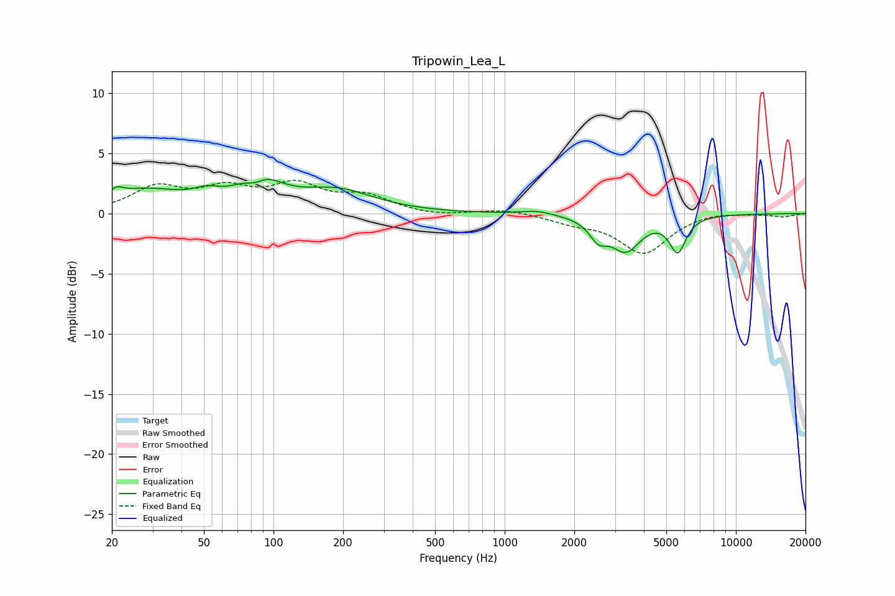

# Tripowin_Lea_L
See [usage instructions](https://github.com/jaakkopasanen/AutoEq#usage) for more options and info.

### Parametric EQs
Apply preamp of -2.9 dB when using parametric equalizer.

|   # | Type    |   Fc (Hz) |    Q |   Gain (dB) |
|-----|---------|-----------|------|-------------|
|   1 | Peaking |        21 | 5.85 |         0.5 |
|   2 | Peaking |        27 | 0.76 |         1.9 |
|   3 | Peaking |        52 | 2.7  |         0.7 |
|   4 | Peaking |        84 | 3.17 |        -1.1 |
|   5 | Peaking |        86 | 1.62 |         2.8 |
|   6 | Peaking |       188 | 0.89 |         1.8 |
|   7 | Peaking |      1378 | 2.18 |         0.3 |
|   8 | Peaking |      2542 | 3.66 |        -1.5 |
|   9 | Peaking |      3341 | 2.2  |        -2.8 |
|  10 | Peaking |      5600 | 3.98 |        -2.9 |

### Fixed Band EQs
When using fixed band (also called graphic) equalizer, apply preamp of **-2.9 dB** (if available) and set gains manually with these parameters.

|   # | Type    |   Fc (Hz) |    Q |   Gain (dB) |
|-----|---------|-----------|------|-------------|
|   1 | Peaking |        31 | 1.41 |         2   |
|   2 | Peaking |        62 | 1.41 |         1.8 |
|   3 | Peaking |       125 | 1.41 |         2.1 |
|   4 | Peaking |       250 | 1.41 |         1.3 |
|   5 | Peaking |       500 | 1.41 |        -0.2 |
|   6 | Peaking |      1000 | 1.41 |         0.4 |
|   7 | Peaking |      2000 | 1.41 |        -0.6 |
|   8 | Peaking |      4000 | 1.41 |        -3.2 |
|   9 | Peaking |      8000 | 1.41 |         0.2 |
|  10 | Peaking |     16000 | 1.41 |        -0.3 |

### Graphs

