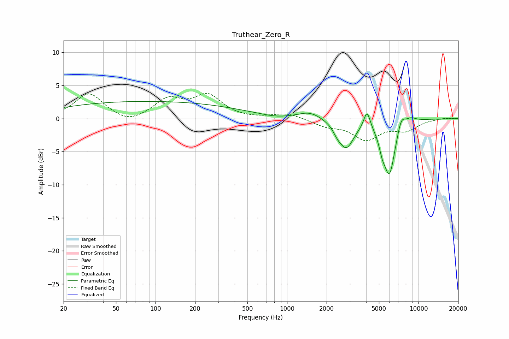

# Truthear_Zero_R
See [usage instructions](https://github.com/jaakkopasanen/AutoEq#usage) for more options and info.

### Parametric EQs
Apply preamp of -2.7 dB when using parametric equalizer.

|   # | Type    |   Fc (Hz) |    Q |   Gain (dB) |
|-----|---------|-----------|------|-------------|
|   1 | Peaking |        86 | 0.18 |         2.6 |
|   2 | Peaking |       815 | 1.25 |        -0.4 |
|   3 | Peaking |      1497 | 1.61 |         1.1 |
|   4 | Peaking |      2416 | 4.49 |        -0.8 |
|   5 | Peaking |      2825 | 2.46 |        -4.2 |
|   6 | Peaking |      4058 | 5.73 |         2.7 |
|   7 | Peaking |      5286 | 5.98 |        -1.6 |
|   8 | Peaking |      6007 | 3.05 |        -8.2 |
|   9 | Peaking |      7383 | 4.45 |         2   |
|  10 | Peaking |      8697 | 2.98 |         0.7 |

### Fixed Band EQs
When using fixed band (also called graphic) equalizer, apply preamp of **-3.9 dB** (if available) and set gains manually with these parameters.

|   # | Type    |   Fc (Hz) |    Q |   Gain (dB) |
|-----|---------|-----------|------|-------------|
|   1 | Peaking |        31 | 1.41 |         3.8 |
|   2 | Peaking |        62 | 1.41 |        -1   |
|   3 | Peaking |       125 | 1.41 |         2.7 |
|   4 | Peaking |       250 | 1.41 |         3.3 |
|   5 | Peaking |       500 | 1.41 |        -0.1 |
|   6 | Peaking |      1000 | 1.41 |         0.8 |
|   7 | Peaking |      2000 | 1.41 |        -1   |
|   8 | Peaking |      4000 | 1.41 |        -3   |
|   9 | Peaking |      8000 | 1.41 |        -1.6 |
|  10 | Peaking |     16000 | 1.41 |         0.1 |

### Graphs

