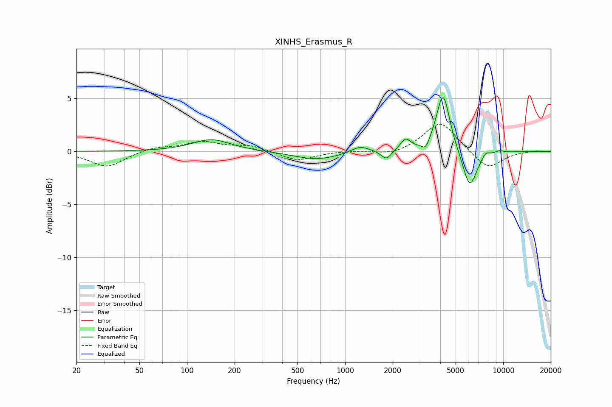

# XINHS_Erasmus_R
See [usage instructions](https://github.com/jaakkopasanen/AutoEq#usage) for more options and info.

### Parametric EQs
Apply preamp of -5.2 dB when using parametric equalizer.

|   # | Type    |   Fc (Hz) |    Q |   Gain (dB) |
|-----|---------|-----------|------|-------------|
|   1 | Peaking |       143 | 1.17 |         1.1 |
|   2 | Peaking |       662 | 0.98 |        -0.8 |
|   3 | Peaking |      1245 | 2.44 |         0.6 |
|   4 | Peaking |      1823 | 4.42 |        -0.9 |
|   5 | Peaking |      2407 | 4.4  |         1.1 |
|   6 | Peaking |      3232 | 6    |        -0.8 |
|   7 | Peaking |      4167 | 3.31 |         5.6 |
|   8 | Peaking |      6140 | 3.06 |        -3.6 |
|   9 | Peaking |      7764 | 5.94 |         0.5 |
|  10 | Peaking |      9440 | 5.15 |         0.2 |

### Fixed Band EQs
When using fixed band (also called graphic) equalizer, apply preamp of **-2.7 dB** (if available) and set gains manually with these parameters.

|   # | Type    |   Fc (Hz) |    Q |   Gain (dB) |
|-----|---------|-----------|------|-------------|
|   1 | Peaking |        31 | 1.41 |        -1.5 |
|   2 | Peaking |        62 | 1.41 |         0.4 |
|   3 | Peaking |       125 | 1.41 |         0.9 |
|   4 | Peaking |       250 | 1.41 |         0.5 |
|   5 | Peaking |       500 | 1.41 |        -0.9 |
|   6 | Peaking |      1000 | 1.41 |         0.1 |
|   7 | Peaking |      2000 | 1.41 |        -0.4 |
|   8 | Peaking |      4000 | 1.41 |         2.9 |
|   9 | Peaking |      8000 | 1.41 |        -1.7 |
|  10 | Peaking |     16000 | 1.41 |         0.1 |

### Graphs

